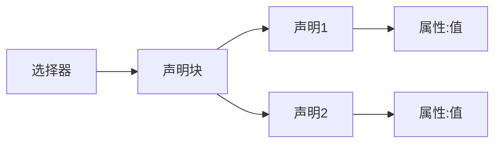
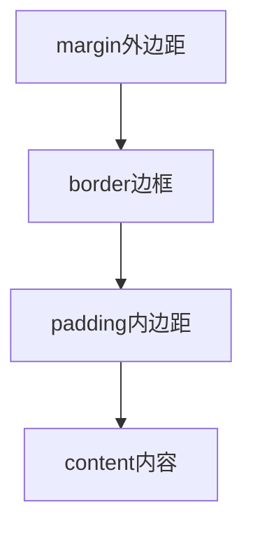
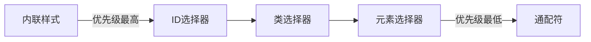

# CSS基础

CSS(层叠样式表)是用于为网页添加样式的语言。它不是编程语言,而是一门样式表语言。

## CSS规则集结构



## 盒子模型



## 常用选择器

| 选择器类型 | 语法     | 示例         |
| ---------- | -------- | ------------ |
| 元素选择器 | 标签名   | p { }        |
| ID选择器   | #id名    | #myid { }    |
| 类选择器   | .类名    | .myclass { } |
| 属性选择器 | [属性名] | [src] { }    |
| 伪类选择器 | :状态    | a:hover { }  |

## 练习题

1. 补全代码,实现段落文字居中且颜色为红色:
```css
p {
  /* 补全这里 */
}
```

2. 补全代码,给div添加内边距20px和黑色边框:
```css
div {
  /* 补全这里 */
}
```

3. 补全代码,选择class为highlight的元素,设置黄色背景:
```css
/* 补全这里 */ {
  background-color: yellow;
}
```

<details>
<summary>参考答案</summary>

1. 
```css
p {
  text-align: center;
  color: red;
}
```

2.
```css
div {
  padding: 20px;
  border: 1px solid black;
}
```

3.
```css
.highlight {
  background-color: yellow;
}
```
</details>

## 重要概念

1. CSS可以通过三种方式引入:
- 外部样式表(link标签)
- 内部样式表(style标签)
- 内联样式(style属性)

2. CSS继承
- 某些属性会从父元素继承到子元素
- 常见的可继承属性:color、font-size、font-family等

3. CSS优先级


| 选择器类型 | 语法         | 示例                 | 说明                      |
| ---------- | ------------ | -------------------- | ------------------------- |
| 属性选择器 | [属性名]     | [src] { }            | 选择有src属性的元素       |
|            | [属性名=值]  | [class="box"] { }    | 选择class值为box的元素    |
|            | [属性名^=值] | [class^="btn-"] { }  | 选择class以btn-开头的元素 |
|            | [属性名$=值] | [href$=".pdf"] { }   | 选择href以.pdf结尾的元素  |
|            | [属性名*=值] | [title*="hello"] { } | 选择title包含hello的元素  |

```css
/* 选择所有class为btn-primary、btn-secondary等的元素 */
[class^="btn-"] {
  padding: 10px;
}

/* 选择所有href链接指向PDF文件的元素 */
[href$=".pdf"] {
  background: url(pdf-icon.png) no-repeat;
}
```