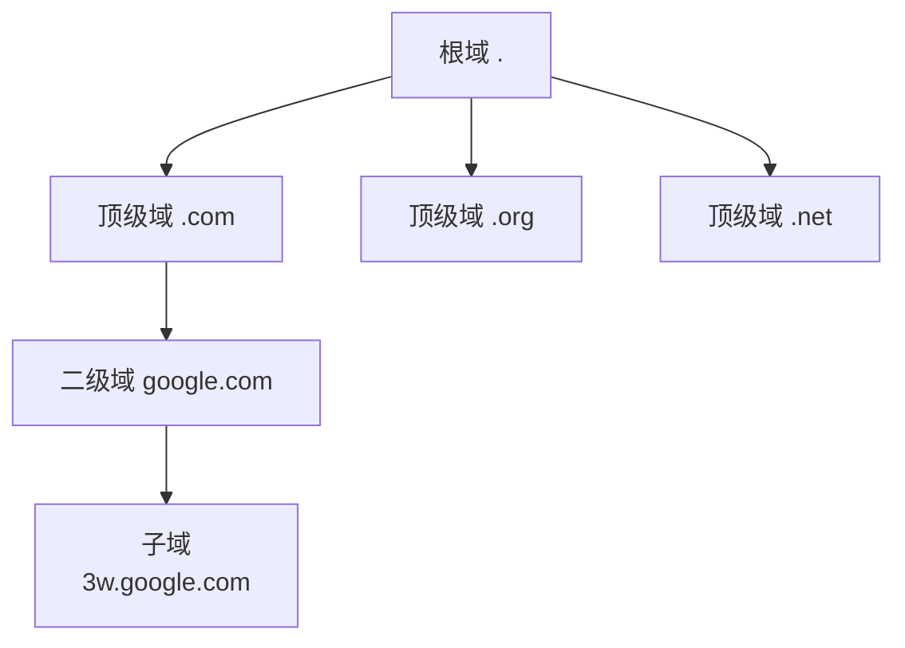
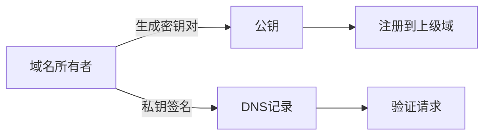
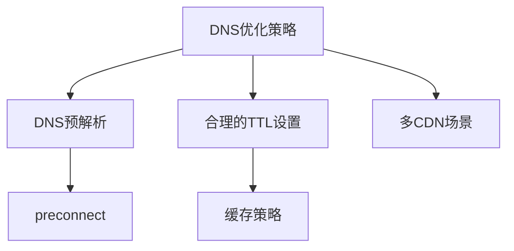

# DNS域名解析系统

## 1. 基本概念

DNS(Domain Name System)是一个分布式的域名解析系统,主要用于将人类可读的域名(如www.google.com)转换为IP地址。

### 1.1 FQDN
完全合格域名(FQDN)是指域名在DNS树中的完整路径,从节点到DNS树根的完整表示方式。例如:
- google.com (FQDN)
- www.google.com (www是google域中的子域)

### 1.2 DNS层级结构



### 1.3 DNS记录类型

- SOA记录: 起始授权记录,定义域的全局参数
- NS记录: 域名服务器记录
- A记录: 将域名映射到IPv4地址
- PTR记录: 反向解析,IP地址到域名的映射
- CNAME记录: 域名别名记录
- MX记录: 邮件交换记录

### 1.4 DNS查询方式

1. 递归查询: 一次性返回最终结果
2. 迭代查询: DNS服务器之间的交互查询

## 2. 实践题目

### 题目1: DNS记录类型匹配
将左侧的DNS记录类型与右侧的功能描述匹配:

<details><summary>题目内容</summary>

```javascript
const records = {
  "A": "____", // 补充:将域名解析为IPv4地址
  "CNAME": "____", // 补充:创建域名别名
  "MX": "____", // 补充:指定邮件服务器
}
```

</details>

<details><summary>参考答案</summary>

```javascript
const records = {
  "A": "将域名解析为IPv4地址",
  "CNAME": "创建域名别名",
  "MX": "指定邮件服务器"
}
```

</details>

### 题目2: DNS查询过程实现
补充代码实现一个简单的DNS查询过程模拟:

<details><summary>题目内容</summary>

```javascript
async function dnsQuery(domain) {
  // 1. 检查本地缓存
  const cache = await checkCache(domain);
  if(cache) return cache;
  
  // 2. 查询根域名服务器
  // 补充代码:调用queryRootServer函数
  __________

  // 3. 查询顶级域名服务器
  // 补充代码:调用queryTLDServer函数
  __________
  
  return ip;
}
```

</details>

<details><summary>参考答案</summary>

```javascript
async function dnsQuery(domain) {
  const cache = await checkCache(domain);
  if(cache) return cache;
  
  const rootServer = await queryRootServer(domain);
  const ip = await queryTLDServer(rootServer, domain);
  
  return ip;
}
```

</details>

### 题目3: DNS缓存实现
实现一个简单的DNS缓存系统:

<details><summary>题目内容</summary>

```javascript
class DNSCache {
  constructor() {
    // 补充代码:初始化缓存对象和TTL映射
    this.cache = _______;
    this.ttl = _______;
  }

  set(domain, ip, ttl = 3600) {
    // 补充代码:设置缓存,包含过期时间
    _______
  }
}
```

</details>

<details><summary>参考答案</summary>

```javascript
class DNSCache {
  constructor() {
    this.cache = new Map();
    this.ttl = new Map();
  }

  set(domain, ip, ttl = 3600) {
    this.cache.set(domain, ip);
    this.ttl.set(domain, Date.now() + ttl * 1000);
  }
}
```

</details>

这些练习题目帮助你理解:
1. DNS记录类型的基本概念
2. DNS查询的基本流程
3. DNS缓存的实现原理

通过这些练习,你可以更好地理解DNS系统的工作原理和实现细节。


## 3. DNS进阶概念

### 3.1 DNS安全(DNSSEC)

DNSSEC通过数字签名确保DNS查询的安全性:



### 3.2 DNS负载均衡

前端开发中常见的DNS负载均衡方式:

1. 轮询(Round Robin)DNS
2. 地理位置DNS
3. 权重DNS

### 3.3 前端开发相关的DNS概念

1. DNS预解析
```html
<link rel="dns-prefetch" href="//example.com">
```

2. 常见的DNS调试工具
- dig
- nslookup
- Chrome DevTools Network面板

### 3.4 DNS优化实践



## 4. 实践题目

### 题目4: DNS负载均衡实现

<details><summary>题目内容</summary>

```javascript
class DNSLoadBalancer {
  constructor() {
    this.servers = [];
    this.currentIndex = 0;
  }
  
  // 补充轮询算法代码
  getNextServer() {
    ______
  }
}
```
</details>

<details><summary>参考答案</summary>

```javascript
class DNSLoadBalancer {
  constructor() {
    this.servers = [];
    this.currentIndex = 0;
  }
  
  getNextServer() {
    const server = this.servers[this.currentIndex];
    this.currentIndex = (this.currentIndex + 1) % this.servers.length;
    return server;
  }
}
```
</details>

### 题目5: DNS预解析实现

<details><summary>题目内容</summary>

```javascript
function optimizeDNS(domains) {
  // 补充代码:为数组中的域名添加DNS预解析
  // domains = ['api.example.com', 'cdn.example.com']
  ______
}
```
</details>

<details><summary>参考答案</summary>

```javascript
function optimizeDNS(domains) {
  domains.forEach(domain => {
    const link = document.createElement('link');
    link.rel = 'dns-prefetch';
    link.href = `//${domain}`;
    document.head.appendChild(link);
  });
}
```
</details>

## 5. 推荐学习资源

1. DNS工具网站:
- [DNS查询](https://toolbox.googleapps.com/apps/dig/)
- [DNSPod](https://www.dnspod.cn/)

2. 学习资源:
- [MDN DNS文档](https://developer.mozilla.org/zh-CN/docs/Web/Performance/dns-prefetch)
- [Chrome DNS文档](https://developer.chrome.com/docs/lighthouse/performance/uses-dns-prefetch)

3. 性能优化相关:
- [Web性能优化-DNS预解析](https://web.dev/preconnect-and-dns-prefetch/)

## 6. 前端开发者常见DNS问题

1. 跨域资源DNS解析
2. CDN域名选择
3. 多域名性能优化
4. HTTPS证书与DNS
5. 本地开发环境DNS配置

这些内容应该能帮助前端开发者更好地理解和使用DNS系统。建议重点关注:
1. DNS预解析和预连接优化
2. 资源域名合并策略
3. CDN域名选择和配置
4. 开发环境DNS调试方法