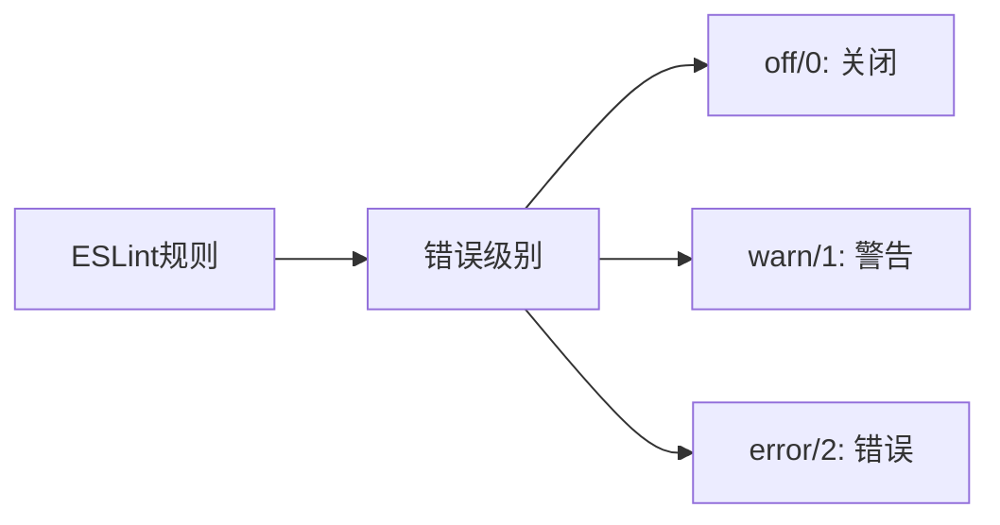

# ESLint 配置指南

### ESLint 是什么?

ESLint 是一个开源的 JavaScript 代码检查工具，它可以帮助我们:
- 发现代码问题
- 统一代码风格
- 避免潜在的错误
- 提高代码质量

### 基础配置

1. 首先安装 ESLint:

```bash
npm install eslint --save-dev
```

2. 初始化配置:

```bash
npx eslint --init
```

3. 基本的配置文件 (.eslintrc.js):

```javascript
module.exports = {
  // 环境配置
  env: {
    browser: true,
    es2021: true,
    node: true,
  },
  
  // 继承其他配置
  extends: [
    'eslint:recommended',
    'plugin:@typescript-eslint/recommended', // 如果使用 TypeScript
  ],
  
  // 解析器配置
  parser: '@typescript-eslint/parser', // 如果使用 TypeScript
  
  // 规则配置
  rules: {
    'indent': ['error', 2], // 缩进使用 2 空格
    'quotes': ['error', 'single'], // 使用单引号
    'semi': ['error', 'always'], // 必须使用分号
    'no-console': 'warn', // console 语句警告
  }
};
```

### 常用规则说明



### 配合 VS Code 使用

1. 安装 ESLint 插件
2. 在 settings.json 中添加配置:

```json
{
  "editor.codeActionsOnSave": {
    "source.fixAll.eslint": true
  },
  "eslint.validate": [
    "javascript",
    "javascriptreact",
    "typescript",
    "typescriptreact"
  ]
}
```

### 常用的扩展配置

1. Airbnb 配置:
```bash
npx install-peerdeps --dev eslint-config-airbnb
```

2. Standard 配置:
```bash
npm install --save-dev eslint-config-standard
```

### 忽略文件

创建 .eslintignore 文件:

```text
node_modules
dist
build
*.test.js
```

### 实用技巧

1. 使用 --fix 自动修复:
```bash
npx eslint --fix src/
```

2. 在 package.json 中添加脚本:
```json
{
  "scripts": {
    "lint": "eslint src/",
    "lint:fix": "eslint src/ --fix"
  }
}
```

### 常见问题解决方案

<details><summary>如何处理与 Prettier 的冲突？</summary>

```bash
npm install --save-dev eslint-config-prettier eslint-plugin-prettier
```

然后在 .eslintrc.js 中添加:

```javascript
module.exports = {
  extends: [
    // ... 其他配置
    'plugin:prettier/recommended'
  ]
}
```
</details>

<details><summary>如何处理特定文件的特殊规则？</summary>

在 .eslintrc.js 中使用 overrides:

```javascript
module.exports = {
  // ... 其他配置
  overrides: [
    {
      files: ['*.test.js'],
      rules: {
        'no-unused-expressions': 'off'
      }
    }
  ]
}
```
</details>