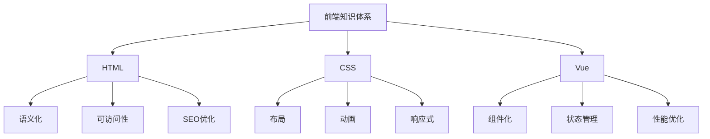

### HTML 相关资源
1. MDN Web Docs (中文版)
   - https://developer.mozilla.org/zh-CN/docs/Web/HTML
   - 这是最权威的 Web 文档，包含了完整的 HTML5 规范和示例

2. HTML5 Rocks (现在已经合并到 Web Fundamentals)
   - https://developers.google.com/web/fundamentals?hl=zh-cn

### CSS 相关资源
1. CSS Tricks
   - https://css-tricks.com/
   - 虽然是英文网站，但里面的实例非常实用

2. CSS Grid Garden
   - https://cssgridgarden.com/#zh-cn
   - 学习 Grid 布局的互动游戏

3. Flexbox Froggy
   - https://flexboxfroggy.com/#zh-cn
   - 学习 Flexbox 的互动游戏

### Vue 相关资源
1. Vue 官方文档
   - https://cn.vuejs.org/
   - 最新的 Vue3 文档非常详尽

2. Vue Mastery
   - https://www.vuemastery.com/
   - 高质量的 Vue 视频教程

3. Vue 技术揭秘
   - https://ustbhuangyi.github.io/vue-analysis/
   - 深入理解 Vue 源码的好资料

### 进阶学习建议

建议按照以下思维导图来梳理知识：

### 学习路线建议

1. **HTML 部分**
   - 重点关注语义化标签的使用
   - Web Components 的概念和应用
   - HTML5 新特性的实践应用

2. **CSS 部分**
   - 现代布局技术（Flex、Grid）
   - CSS 变量和计算函数
   - CSS 模块化方案
   - CSS 动画和过渡

3. **Vue 部分**
   - Vue3 的 Composition API
   - 响应式系统原理
   - 虚拟 DOM 和 diff 算法
   - 性能优化实践

### 实践建议

1. 建立个人的知识库（可以使用 Notion 或 GitBook）
2. 多做实践项目，将学到的知识应用起来
3. 关注前端社区动态（掘金、知乎等）
4. 参与开源项目或建立自己的开源项目

记住，作为一个有经验的开发者，重新梳理知识的重点在于：
- 建立系统性的知识体系
- 理解底层原理
- 掌握最佳实践
- 了解新特性和发展趋势