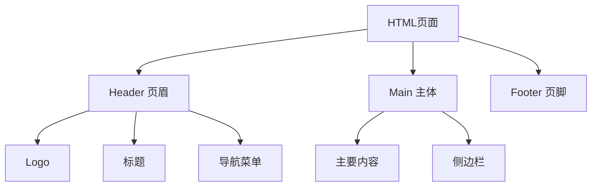

# HTML页面结构构建

## 基本概念

HTML页面的主要结构组成可以用以下mermaid图表示:




### 核心结构元素
1. `<header>`: 页眉区域
2. `<main>`: 主要内容区域
3. `<footer>`: 页脚区域
4. `<nav>`: 导航菜单
5. `<aside>`: 侧边栏

## 实践要点
1. 使用语义化标签构建页面结构
2. 确保HTML结构清晰,便于CSS布局
3. 使用W3C验证器验证HTML代码
4. 通过`<link>`引入外部CSS文件

## 练习题

### 练习1: 补全代码
请补全以下HTML结构中缺失的部分:
```html
<!DOCTYPE html>
<html>
<head>
    <title>观鸟网</title>
    <!-- 在此处添加一行代码链接外部样式表 style.css -->
</head>
<body>
    <!-- 添加一行代码创建页眉区域 -->
    <nav>
        <ul>
            <li><a href="#home">首页</a></li>
            <li><a href="#about">关于</a></li>
        </ul>
    </nav>
    <!-- 添加一行代码创建主要内容区域 -->
</body>
</html>
```


### 练习2: 结构分析
观察下面的内容,选择最适合的HTML结构标签:
```
- 网站logo和标题
- 热门文章列表
- 版权信息
- 相关推荐
```


### 练习3: 实战练习
创建一个简单的博客文章页面结构,需要包含:
- 页眉(包含网站标题)
- 导航菜单
- 主要内容区域(文章内容)
- 侧边栏(作者信息)
- 页脚(版权信息)

<details>
<summary>参考答案</summary>

### 练习1答案:
```html
<!-- 添加CSS链接 -->
<link rel="stylesheet" href="style.css">

<!-- 创建页眉 -->
<header>
    <h1>观鸟网</h1>
</header>

<!-- 创建主要内容区域 -->
<main>
    <article>
        <h2>欢迎访问</h2>
        <p>页面内容</p>
    </article>
</main>
```


### 练习2答案:
- 网站logo和标题: `<header>`
- 热门文章列表: `<aside>`或`<section>`
- 版权信息: `<footer>`
- 相关推荐: `<aside>`

### 练习3答案:
```html
<!DOCTYPE html>
<html>
<head>
    <title>我的博客</title>
</head>
<body>
    <header>
        <h1>我的博客</h1>
        <nav>
            <ul>
                <li><a href="#home">首页</a></li>
                <li><a href="#about">关于</a></li>
            </ul>
        </nav>
    </header>
    
    <main>
        <article>
            <h2>文章标题</h2>
            <p>文章内容...</p>
        </article>
        
        <aside>
            <h3>作者信息</h3>
            <p>作者简介...</p>
        </aside>
    </main>
    
    <footer>
        <p>&copy; 2024 我的博客. 保留所有权利。</p>
    </footer>
</body>
</html>
```

</details>