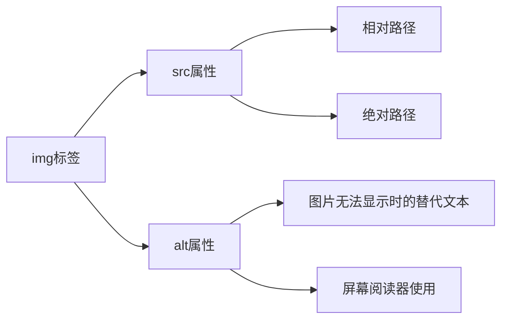
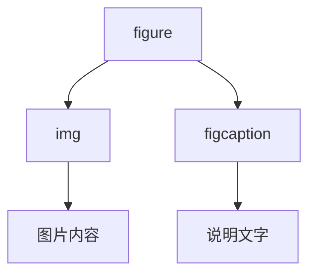
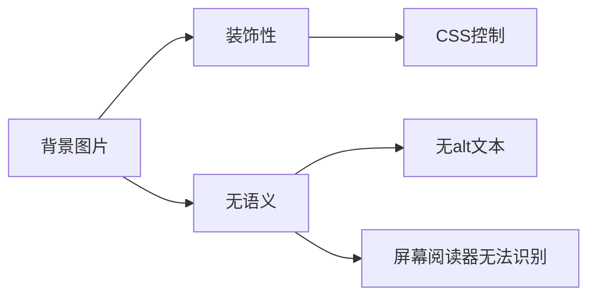
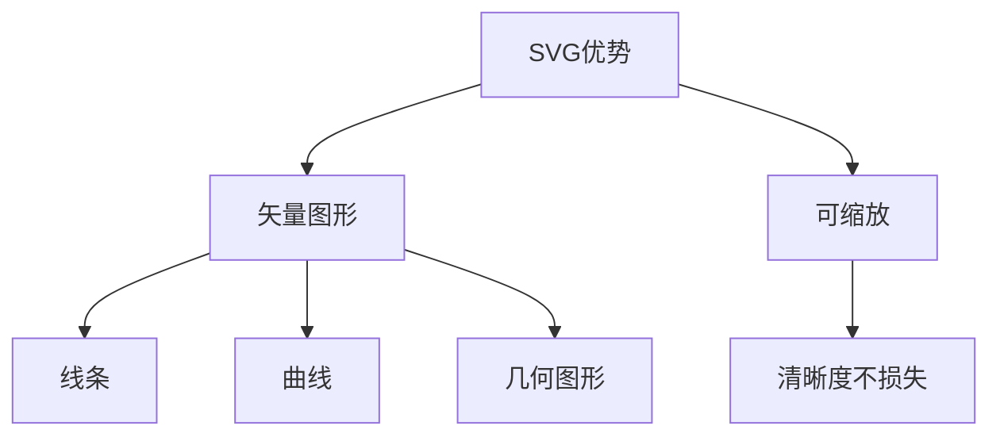
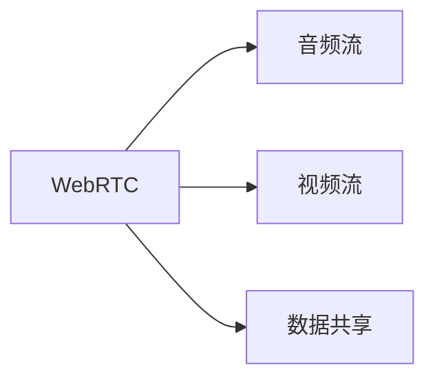

# HTML中的图片

## 基本概念

### img标签
`` 是一个空元素,用于在网页中嵌入图片,需要两个基本属性:
- src: 指定图片的URL路径
- alt: 图片的替代文本描述



### 图片尺寸属性
- width: 图片宽度(像素)
- height: 图片高度(像素)

### figure和figcaption
用于为图片添加语义化的说明文字:


## 实践练习

### 练习1: 基础图片插入
补全下面的代码,插入一张图片并添加合适的alt文本:
```html
<___ src="images/cat.jpg" ___="一只正在睡觉的橘猫">
```

### 练习2: 添加图片说明
将下面的图片和说明文字改写为语义化的形式:
```html
<!-- 原代码 -->
<div>
  
  <p>春天盛开的玫瑰</p>
</div>

<!-- 请改写为使用figure和figcaption的形式 -->
```

### 练习3: 响应式图片尺寸
补全下面的代码,使图片在保持原始比例的情况下最大宽度为500px:
```css
img {
  max-___: 500px;
  ___: auto;
}
```

<details>
<summary>参考答案</summary>

练习1:
```html

```

练习2:
```html
<figure>
  
  <figcaption>春天盛开的玫瑰</figcaption>
</figure>
```

练习3:
```css
img {
  max-width: 500px;
  height: auto;
}
```

</details>


# HTML中的图形和多媒体

## 基本概念

### CSS背景图片
使用 `background-image` 属性设置背景图片,主要用于装饰性图片。



### Canvas
提供2D图形绘制API,使用JavaScript控制。

### SVG
矢量图形格式,可无损缩放。



### 音视频元素
- video: 视频播放
- audio: 音频播放

### WebRTC
实时通信技术,支持:


## 实践练习

### 练习1: CSS背景图片
补全CSS代码,为div设置背景图片并使其居中显示:
```css
div {
  ___-image: url("bg.jpg");
  ___-position: center;
  ___-repeat: no-repeat;
}
```

### 练习2: Canvas绘制
补全JavaScript代码,在canvas上绘制一个红色矩形:
```javascript
const canvas = document.getElementById('myCanvas');
const ctx = canvas.___('2d');
ctx.___Style = 'red';
ctx.___Rect(10, 10, 100, 50);
```

### 练习3: 视频播放器
补全HTML代码,创建一个带控制条的视频播放器:
```html
<_____ controls>
  <source src="video.mp4" type="video/mp4">
  您的浏览器不支持视频播放
</___>
```

<details>
<summary>参考答案</summary>

练习1:
```css
div {
  background-image: url("bg.jpg");
  background-position: center;
  background-repeat: no-repeat;
}
```

练习2:
```javascript
const canvas = document.getElementById('myCanvas');
const ctx = canvas.getContext('2d');
ctx.fillStyle = 'red';
ctx.fillRect(10, 10, 100, 50);
```

练习3:
```html
<video controls>
  <source src="video.mp4" type="video/mp4">
  您的浏览器不支持视频播放
</video>
```

</details>