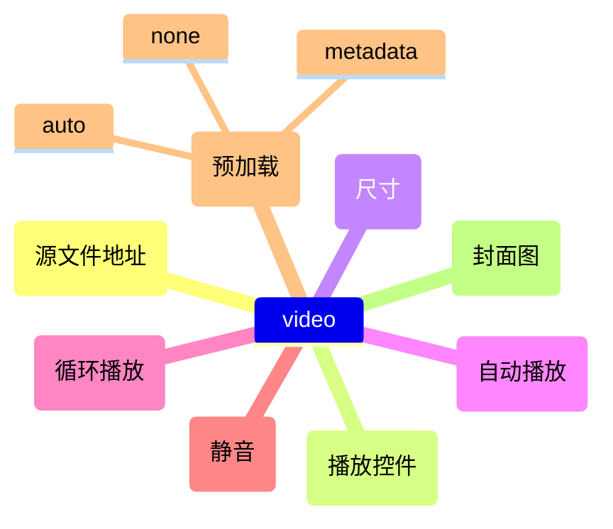
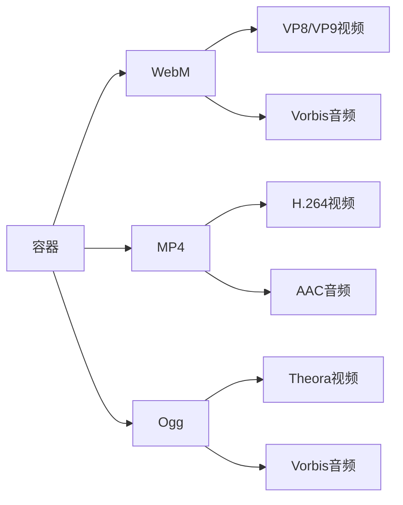

# HTML音视频内容

## 基本概念

### 视频元素 `<video>`
主要属性:


### 音频元素 `<audio>`
与video类似,但不支持:
- width/height 
- poster

### 容器和编码格式


### 字幕支持
使用WebVTT格式(.vtt文件)通过`<track>`元素添加:
- subtitles: 翻译字幕
- captions: 同步翻译对白
- descriptions: 视觉内容描述

## 练习题

### 题目1: 基础视频播放器
补充代码,实现一个基础的视频播放器,要求:
- 显示控制条
- 设置宽度为400px
- 支持MP4和WebM两种格式
- 显示"不支持视频"的后备内容

```html
<video ______>
  <source src="video.mp4" type="video/mp4">
  <source ______ type="video/webm">
  ______
</video>
```

### 题目2: 音频播放器带字幕
补充代码,实现一个带西班牙语字幕的音频播放器:

```html
<audio controls>
  <source src="audio.mp3" type="audio/mp3">
  ______ kind="subtitles" src="subs_es.vtt" ______ label="Spanish">
</audio>
```

### 题目3: 视频海报图
实现一个带有海报图的视频播放器,要求自动播放且循环:

```html
<video ______ poster="cover.jpg" ______ ______>
  <source src="video.mp4" type="video/mp4">
</video>
```

<details>
<summary>参考答案</summary>

题目1:
```html
<video controls width="400">
  <source src="video.mp4" type="video/mp4">
  <source src="video.webm" type="video/webm">
  <p>你的浏览器不支持HTML5视频</p>
</video>
```

题目2:
```html
<audio controls>
  <source src="audio.mp3" type="audio/mp3">
  <track kind="subtitles" src="subs_es.vtt" srclang="es" label="Spanish">
</audio>
```

题目3:
```html
<video controls poster="cover.jpg" autoplay loop>
  <source src="video.mp4" type="video/mp4">
</video>
```

</details>