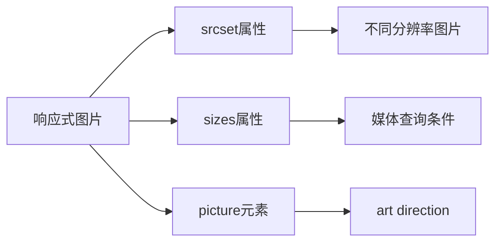
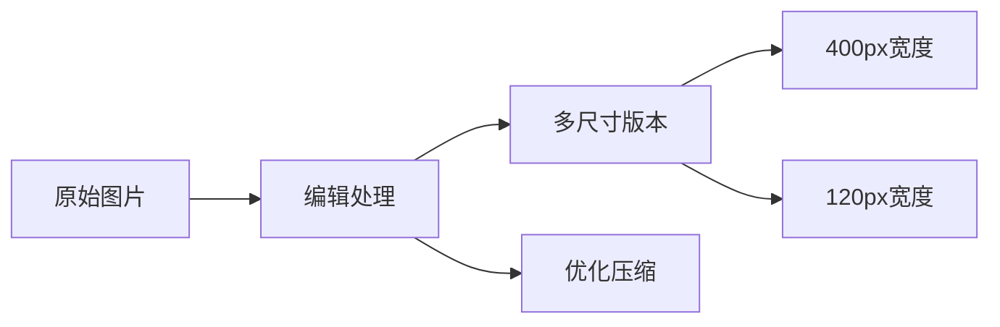

# Mozilla欢迎页面实践

## 基本概念

### 响应式图片技术



### 图片尺寸处理



## 关键知识点
1. `` 标签的响应式属性:
   - srcset: 定义多个图片源
   - sizes: 定义媒体查询条件
2. `<picture>` 元素用于art direction场景
3. 视频嵌入使用`<iframe>`标签

## 练习题

### 练习1: 响应式图片实现
补全下面代码,实现在视口宽度<=500px时使用120px宽图片,其他情况使用400px宽图片:

```html

```


### 练习2: Picture元素实现
补全代码,实现在视口宽度<=600px时显示竖版图片:

```html
<picture>
    ______
    
</picture>
```


### 练习3: 视频嵌入
补全bilibili视频嵌入代码,设置宽度为400px:

```html
<iframe src="//player.bilibili.com/player.html?bvid=BV1rs411d7hC&page=2" 
       ______
       ______
       frameborder="0" 
       allowfullscreen>
</iframe>
```


<details>
<summary>参考答案</summary>

### 练习1答案:
```html

```


### 练习2答案:
```html
<picture>
    <source media="(max-width: 600px)" srcset="panda-vertical.jpg">
    
</picture>
```


### 练习3答案:
```html
<iframe src="//player.bilibili.com/player.html?bvid=BV1rs411d7hC&page=2"
       width="400" 
       height="300"
       frameborder="0"
       allowfullscreen>
</iframe>
```

</details>