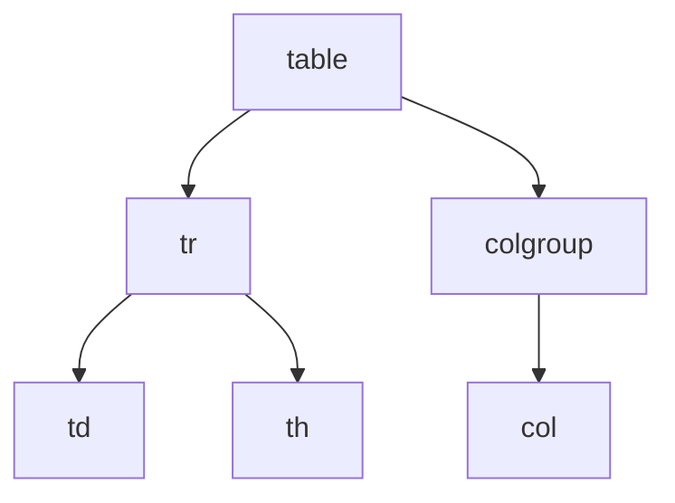

# HTML表格基础

## 基本概念

表格是由行和列组成的结构化数据集,用于展示数据之间的关系。

### 核心元素



- `<table>`: 定义表格
- `<tr>`: 定义表格行
- `<td>`: 定义表格单元格
- `<th>`: 定义表格标题单元格
- `<colgroup>/<col>`: 定义列的样式

### 单元格合并属性

- colspan: 跨列合并
- rowspan: 跨行合并

## 使用场景

✅ 适用场景:
- 展示结构化数据
- 数据之间有明确的关系
- 需要按行列组织的信息

❌ 不适用场景:
- 页面布局
- 纯展示用途的内容排版

## 练习题

### 1. 基础表格创建

补全代码,创建一个2行3列的表格,第一行是表头:

```html
<table border="1">
  <tr>
    <!-- 在此处添加3个th元素,内容分别是"姓名","年龄","性别" -->
  </tr>
  <tr>
    <!-- 在此处添加3个td元素,内容分别是"张三","18","男" -->
  </tr>
</table>
```

### 2. 单元格合并

补全代码,让"总计"单元格横跨3列:

```html
<table border="1">
  <tr>
    <td>项目1</td>
    <td>项目2</td>
    <td>项目3</td>
  </tr>
  <tr>
    <!-- 添加一个td元素,内容为"总计",并横跨3列 -->
  </tr>
</table>
```

### 3. 列样式设置

为第二列设置黄色背景:

```html
<table>
  <!-- 添加colgroup和col元素,为第二列设置背景色 -->
  <tr>
    <td>列1</td>
    <td>列2</td>
  </tr>
  <tr>
    <td>数据1</td>
    <td>数据2</td>
  </tr>
</table>
```

<details>
<summary>参考答案</summary>

1. 基础表格创建:
```html
<tr>
    <th>姓名</th>
    <th>年龄</th>
    <th>性别</th>
</tr>
```

2. 单元格合并:
```html
<td colspan="3">总计</td>
```

3. 列样式设置:
```html
<colgroup>
    <col>
    <col style="background-color: yellow">
</colgroup>
```
</details>