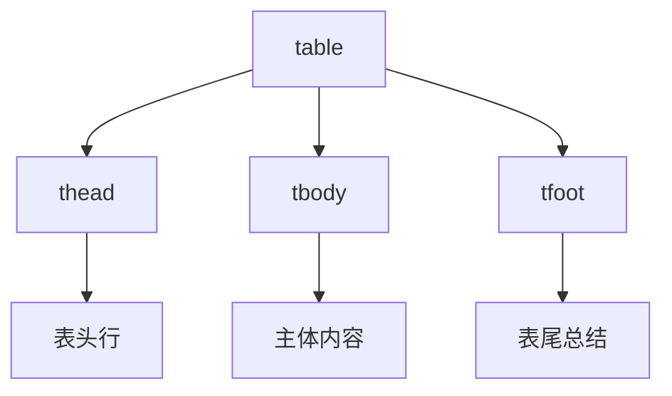
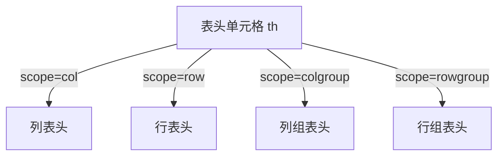
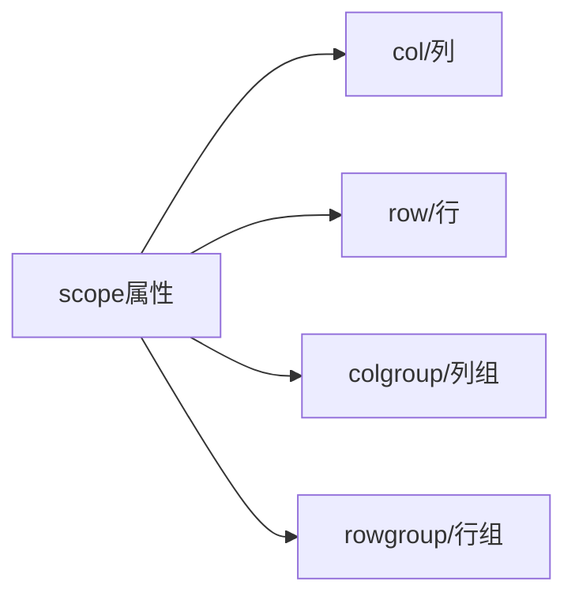

# HTML表格进阶和无障碍

## 基本概念

### 1. 表格标题 `<caption>`
- 位置: 必须放在`<table>`标签下面
- 作用: 为表格提供描述性标题
- 无障碍价值: 帮助屏幕阅读器用户快速理解表格内容

### 2. 表格结构化元素



### 3. 无障碍属性

#### scope属性

scope属性主要用于提高表格的可访问性，特别是对于使用屏幕阅读器的用户。它帮助明确表头单元格(th)与数据单元格(td)之间的关系。

示例代码：
```html
<table>
  <tr>
    <th scope="col">姓名</th>
    <th scope="col">年龄</th>
  </tr>
  <tr>
    <td>小明</td>
    <td>18</td>
  </tr>
</table>
```

scope属性有以下几个值：
1. `col` - 表示这个表头单元格是列的表头
2. `row` - 表示这个表头单元格是行的表头
3. `colgroup` - 表示这个表头单元格是列组的表头
4. `rowgroup` - 表示这个表头单元格是行组的表头



课程表示例：
```html
<table>
  <tr>
    <th scope="row">星期一</th>
    <td>语文</td>
    <td>数学</td>
  </tr>
  <tr>
    <th scope="row">星期二</th>
    <td>英语</td>
    <td>物理</td>
  </tr>
</table>
```

scope属性的主要作用：
1. 提高表格的语义化
2. 改善屏幕阅读器的阅读体验
3. 帮助视障用户更好地理解表格内容的结构关系


用于`<th>`元素,定义表头的作用范围:


#### id和headers属性
- id: 为表头单元格定义唯一标识
- headers: 在数据单元格中引用相关的表头id

## 练习题

### 1. 表格结构补全
补全下面代码中缺失的表格结构标签:

```html
<table>
  <!-- 在此添加caption -->
  <tr>
    <th>姓名</th>
    <th>年龄</th>
  </tr>
  <!-- 在此添加适当的结构标签 -->
  <tr>
    <td>张三</td>
    <td>25</td>
  </tr>
  <tr>
    <td>总计</td>
    <td>25</td>
  </tr>
</table>
```

### 2. 无障碍属性添加
为以下表格添加合适的scope属性:

```html
<table>
  <tr>
    <th>时间/地点</th>
    <th>北京</th>
    <th>上海</th>
  </tr>
  <tr>
    <th>上午</th>
    <td>20°C</td>
    <td>22°C</td>
  </tr>
</table>
```

### 3. headers关联补全
补全下面数据单元格的headers属性:

```html
<table>
  <tr>
    <th id="year">年份</th>
    <th id="city">城市</th>
  </tr>
  <tr>
    <th id="2023">2023</th>
    <td headers="_____ _____">北京</td>
  </tr>
</table>
```

<details>
<summary>参考答案</summary>

1. 表格结构补全:
```html
<table>
  <caption>人员信息表</caption>
  <thead>
    <tr>
      <th>姓名</th>
      <th>年龄</th>
    </tr>
  </thead>
  <tbody>
    <tr>
      <td>张三</td>
      <td>25</td>
    </tr>
  </tbody>
  <tfoot>
    <tr>
      <td>总计</td>
      <td>25</td>
    </tr>
  </tfoot>
</table>
```

2. 无障碍属性添加:
```html
<table>
  <tr>
    <th scope="col">时间/地点</th>
    <th scope="col">北京</th>
    <th scope="col">上海</th>
  </tr>
  <tr>
    <th scope="row">上午</th>
    <td>20°C</td>
    <td>22°C</td>
  </tr>
</table>
```

3. headers关联补全:
```html
<td headers="year 2023">北京</td>
```

</details>