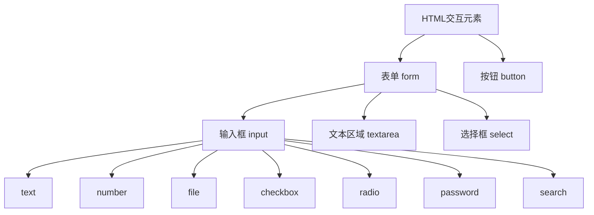

# HTML表单与按钮

## 1. 基本概念

HTML表单和按钮是用户交互的主要工具,主要用于:
- 收集用户数据
- 控制用户界面



## 2. 常见元素

### 2.1 按钮类型
- button: 普通按钮
- submit: 提交表单
- reset: 重置表单

### 2.2 输入类型
- text: 文本输入
- number: 数字输入
- file: 文件上传
- checkbox: 复选框
- radio: 单选框
- password: 密码输入
- search: 搜索框

### 2.3 其他控件
- textarea: 多行文本输入
- select: 下拉选择框
- option: 选项

## 3. 表单验证
- required: 必填项
- min/max: 数值范围
- minlength/maxlength: 文本长度范围
- pattern: 正则表达式匹配

## 4. 无障碍性
- 使用语义化标签
- 使用label元素
- 正确使用for属性

# 练习题

## 1. 补全代码
请补全以下代码,创建一个带有标签的必填文本输入框:

```html
<form>
    <!-- 在这里补充代码 -->
    <input>
</form>
```

## 2. 补全代码
创建一个包含复选框的表单,要求有3个选项,且至少选择2个:

```html
<form>
    <!-- 在这里补充代码 -->
</form>
```

## 3. 实现功能
创建一个表单,包含:
- 用户名(必填)
- 密码(最少6位)
- 年龄(18-100之间)
- 提交按钮

```html
<form>
    <!-- 在这里补充代码 -->
</form>
```

<details>
<summary>参考答案</summary>

1. 文本输入框答案:
```html
<form>
    <label for="username">用户名:</label>
    <input type="text" id="username" name="username" required>
</form>
```

2. 复选框答案:
```html
<form>
    <label><input type="checkbox" name="option1" required> 选项1</label>
    <label><input type="checkbox" name="option2" required> 选项2</label>
    <label><input type="checkbox" name="option3"> 选项3</label>
</form>
```

3. 完整表单答案:
```html
<form>
    <div>
        <label for="username">用户名:</label>
        <input type="text" id="username" name="username" required>
    </div>
    <div>
        <label for="password">密码:</label>
        <input type="password" id="password" name="password" minlength="6" required>
    </div>
    <div>
        <label for="age">年龄:</label>
        <input type="number" id="age" name="age" min="18" max="100" required>
    </div>
    <button type="submit">提交</button>
</form>
```
</details>