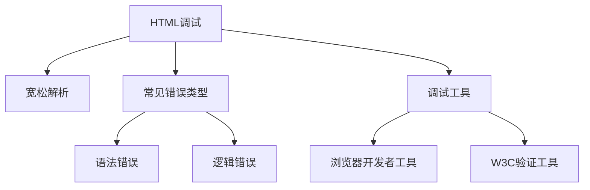

# HTML调试

## 基本概念




### 宽松解析
浏览器对HTML采用宽松解析模式,即使代码存在错误也会尝试渲染。这是Web早期为了普及而采取的策略。

### 常见错误类型
1. 未闭合元素
2. 嵌套错误
3. 属性未闭合
4. 标签缺失

## 调试工具

### 1. 浏览器开发者工具
- 可以查看DOM结构
- 实时检查元素
- 查看浏览器自动修复的结果

### 2. W3C验证工具
- 提供详细的错误报告
- 支持多种验证方式(URL、文件上传、直接输入代码)

## 练习题

### 1. 代码补全题
找出并修复以下HTML代码中的错误:
```html
<div>
    <p>Welcome to my site
    <ul>
        <li>Item 1
        <li>Item 2</li>
    <strong>Important text
</div>
```


### 2. 分析题
观察以下代码,指出所有的错误:
```html
<a href="https://example.com>Click here</a>
<p>This is a <strong>bold<em>and italic</strong></em> text</p>
```


### 3. 实践题
使用W3C验证工具验证以下代码,并解释错误信息:
```html
<h1>My Page
<p>Welcome to my page!
<ul>
    <li>About me
    <li>Contact
</ul>
```


<details>
<summary>参考答案</summary>

### 1. 代码补全题答案
```html
<div>
    <p>Welcome to my site</p>
    <ul>
        <li>Item 1</li>
        <li>Item 2</li>
    </ul>
    <strong>Important text</strong>
</div>
```


### 2. 分析题答案
错误包括:
1. href属性缺少结束引号
2. strong和em标签嵌套顺序错误
正确写法应为:
```html
<a href="https://example.com">Click here</a>
<p>This is a <strong><em>bold and italic</em></strong> text</p>
```


### 3. 实践题答案
错误包括:
1. h1标签未闭合
2. p标签未闭合
3. li标签未闭合

正确代码:
```html
<h1>My Page</h1>
<p>Welcome to my page!</p>
<ul>
    <li>About me</li>
    <li>Contact</li>
</ul>
```

</details>