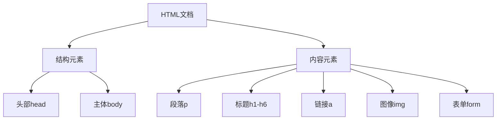
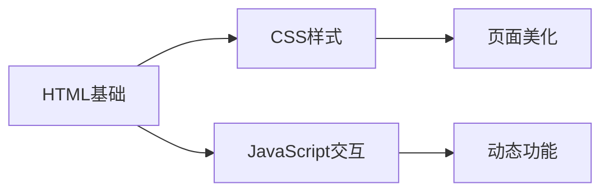

# HTML基础知识

## 什么是HTML?
HTML(超文本标记语言)是用于定义网页结构的基础技术。它通过各种标签来标识内容的类型和结构。



## 学习路径


## 核心模块
1. HTML简介
2. 多媒体和嵌入
3. HTML表格
4. Web表单
5. 常见问题解决

# 练习题

## 1. 基础标签使用
补充代码,创建一个包含标题、段落和链接的HTML结构:
```html
<!DOCTYPE html>
<html>
<head>
    <title>我的第一个页面</title>
</head>
<body>
    <!-- 在这里添加一个一级标题 -->
    _______________
    <!-- 在这里添加一个段落 -->
    _______________
    <!-- 在这里添加一个链接到百度 -->
    _______________
</body>
</html>
```

## 2. 表格创建
补充代码,创建一个2x2的表格:
```html
<table border="1">
    <!-- 添加表头行 -->
    _______________
    <!-- 添加数据行 -->
    _______________
</table>
```

## 3. 图片插入
补充代码,插入一张图片并添加替代文本:
```html
<!-- 插入一张图片,图片地址为"image.jpg",添加适当的alt文本 -->
_______________
```

<details>
<summary>参考答案</summary>

1. 基础标签使用:
```html
<h1>欢迎访问我的网站</h1>
<p>这是我的第一个网页。</p>
<a href="https://www.baidu.com">访问百度</a>
```

2. 表格创建:
```html
<tr>
    <th>表头1</th>
    <th>表头2</th>
</tr>
<tr>
    <td>数据1</td>
    <td>数据2</td>
</tr>
```

3. 图片插入:
```html

```

</details>