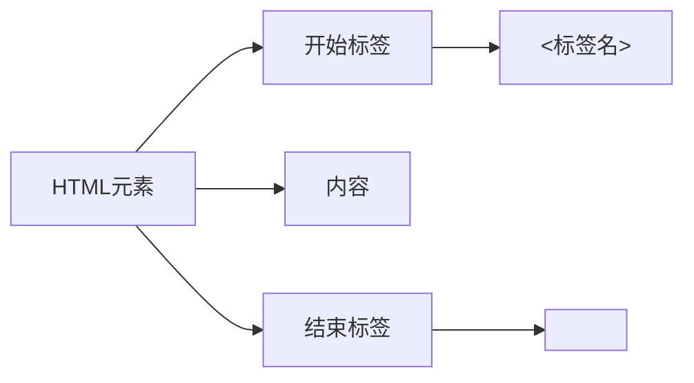
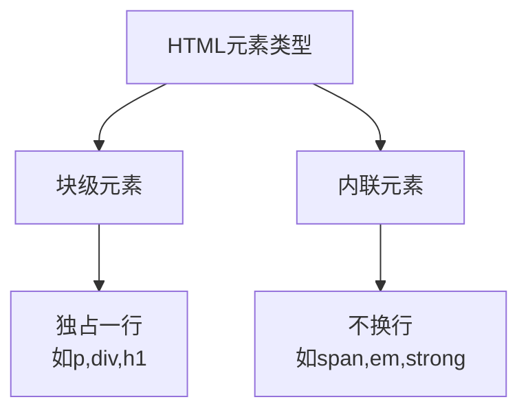

# HTML基础

## 定义
HTML(HyperText Markup Language,超文本标记语言)是一种用来告知浏览器如何组织页面的标记语言。

## HTML元素结构


## 元素类型


## 属性
属性为元素提供额外信息,基本语法:


## 练习题

### 1. 补全代码:创建一个包含标题和段落的HTML结构
```html
<!DOCTYPE html>
<html>
  <head>
    <meta charset="utf-8">
    <!-- 补充代码:添加一个标题 -->
    
  </head>
  <body>
    <!-- 补充代码:添加一个h1标题和p段落 -->
    
  </body>
</html>
```

### 2. 补全代码:为文本添加样式和链接
```html
<p>
  <!-- 补充代码:将"重要"二字加粗,并为"更多信息"添加链接 -->
  这是一段重要的文本,点击更多信息了解详情
</p>
```

### 3. 分析题:以下HTML结构是否正确?为什么?
```html
<p>这是一个<strong>错误的<p>嵌套</strong>示例</p>
```

<details>
<summary>参考答案</summary>

1. HTML结构补全:
```html
<!DOCTYPE html>
<html>
  <head>
    <meta charset="utf-8">
    <title>我的网页</title>
  </head>
  <body>
    <h1>欢迎访问</h1>
    <p>这是一个段落内容</p>
  </body>
</html>
```

2. 文本样式补全:
```html
<p>
  这是一段<strong>重要</strong>的文本,点击<a href="#">更多信息</a>了解详情
</p>
```

3. 分析题:
这个结构是错误的。原因:
- 标签必须正确嵌套,不能交叉
- 正确写法应该是:
```html
<p>这是一个<strong>错误的</strong></p>
<p>嵌套示例</p>
```
</details>