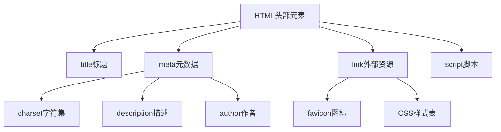

# HTML元信息

## 基本概念

HTML头部(`<head>`)包含了页面的元数据,这些信息在页面加载后不会直接显示,但对浏览器渲染和搜索引擎优化很重要。




### 主要元素说明

1. `<title>` - 定义文档标题
2. `<meta>` - 定义元数据
   - charset - 字符编码
   - description - 页面描述
   - author - 作者信息
3. `<link>` - 引入外部资源
   - favicon - 网站图标
   - stylesheet - CSS样式表
4. `<script>` - 引入JavaScript脚本

## 练习题

### 1. 补全代码
已知一个HTML文件需要:
- 使用UTF-8编码
- 引入外部样式表style.css
- 引入外部脚本main.js(需要延迟加载)
- 设置网站图标为favicon.ico

请补全代码:

```html
<!DOCTYPE html>
<html lang="zh-CN">
<head>
    <!-- 在这里补充代码 -->
    
</head>
<body>
    <h1>Hello World</h1>
</body>
</html>
```


### 2. Meta标签应用
为一个关于编程教程的网页添加合适的meta标签,要求包含:
- 作者信息
- 页面描述(用于SEO)
- Open Graph协议相关信息(用于社交分享)

请补全代码:

```html
<head>
    <title>编程教程</title>
    <!-- 在这里补充代码 -->
    
</head>
```


### 3. 多语言支持
在一个主要使用中文的页面中,有一段英文内容需要正确设置语言标记,请补全代码:

```html
<body>
    <p>这是中文内容</p>
    <!-- 在这里补充英文内容的代码 -->
    
    <p>这又是中文内容</p>
</body>
```


<details>
<summary>参考答案</summary>

### 1. 补全代码答案:
```html
<meta charset="utf-8">
<link rel="stylesheet" href="style.css">
<script src="main.js" defer></script>
<link rel="icon" href="favicon.ico" type="image/x-icon">
```


### 2. Meta标签应用答案:
```html
<meta name="author" content="张三">
<meta name="description" content="全面的编程教程,包含HTML、CSS、JavaScript等Web开发知识">
<meta property="og:title" content="编程教程">
<meta property="og:description" content="全面的编程教程,包含HTML、CSS、JavaScript等Web开发知识">
<meta property="og:image" content="https://example.com/course-image.jpg">
```


### 3. 多语言支持答案:
```html
<p>这是中文内容</p>
<p lang="en">This is English content.</p>
<p>这又是中文内容</p>
```

</details>