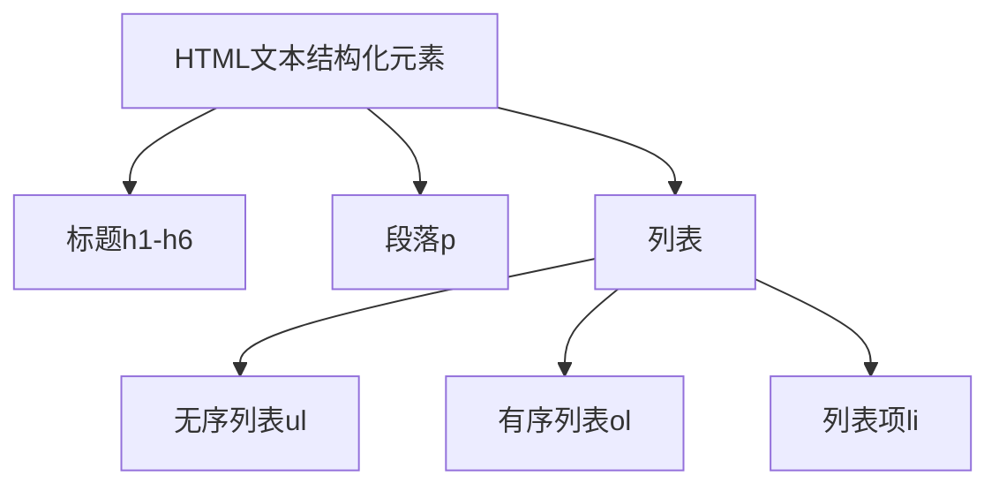
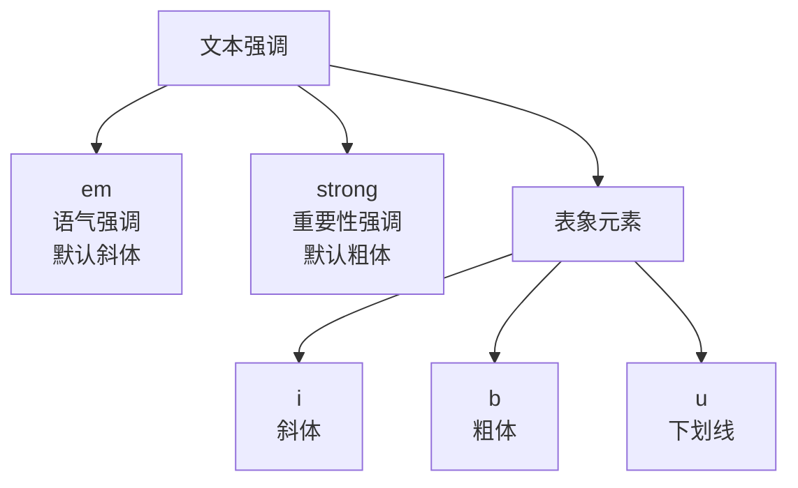

# HTML文本处理基础

## 基本概念

### 文本结构化元素



### 文本强调元素



## 重要规则

1. 每个页面只使用一个h1标题
2. 标题层级要按顺序使用,不要跳级
3. 每页尽量不超过3个标题层级
4. 列表项必须包含在ul/ol中
5. 强调元素要根据语义选择,不要只为样式使用

## 练习题

### 1. 结构化文本
请将下面的文本结构化,使用合适的HTML标签:

```html
青年王卓
王卓是一个21岁的大学生
他的爱好有:
打篮球
编程
看电影
他最喜欢的一句话是:生命不息,奋斗不止
```

<details><summary>参考答案</summary>

```html
<h1>青年王卓</h1>
<p>王卓是一个21岁的大学生</p>
<p>他的爱好有:</p>
<ul>
  <li>打篮球</li>
  <li>编程</li>
  <li>看电影</li>
</ul>
<p>他最喜欢的一句话是:<em>生命不息,奋斗不止</em></p>
```
</details>

### 2. 补全代码
下面的HTML代码缺少了一些标签,请补全:

```html
<h1>烹饪步骤</h1>
___准备材料:鸡蛋、面粉、牛奶___
步骤如下:
___
  1. 将面粉倒入碗中
  2. 打入鸡蛋搅拌
  3. 慢慢倒入牛奶继续搅拌
___
注意:<strong>___不要将面糊搅拌得太稀___</strong>
```

<details><summary>参考答案</summary>

```html
<h1>烹饪步骤</h1>
<p>准备材料:鸡蛋、面粉、牛奶</p>
<p>步骤如下:</p>
<ol>
  <li>将面粉倒入碗中</li>
  <li>打入鸡蛋搅拌</li> 
  <li>慢慢倒入牛奶继续搅拌</li>
</ol>
<p>注意:<strong>不要将面糊搅拌得太稀</strong></p>
```
</details>

### 3. 语义化选择
以下场景应该使用什么标签?请选择最合适的:

1. 标记一个外语单词 _____
2. 标记一段引用的重要文字 _____
3. 标记一个错误的拼写 _____

<details><summary>参考答案</summary>

1. `<i>` - 用于标记外语词汇
2. `<strong>` - 用于标记重要性
3. `<u>` - 用于标记拼写错误
</details>