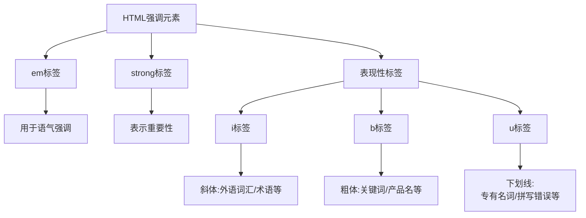

# HTML中的强调和重要性

## 基本概念



### 1. 语气强调 `<em>`
- 用于改变句子语气
- 默认显示为斜体
- 屏幕阅读器会用不同语调读出

### 2. 重要性强调 `<strong>`
- 表示文本的重要性
- 默认显示为粗体
- 屏幕阅读器会强调这部分内容

### 3. 表现性标签
- `<i>`: 用于外语词汇、科学名词等
- `<b>`: 用于关键词、产品名称等
- `<u>`: 用于专有名词、拼写错误标注等

## 练习题

### 1. 语义化标记
请选择合适的标签完成下面的HTML代码:

```html
<p>警告: 这个设备在温度超过___40度___时可能会___发生爆炸___!</p>
```

### 2. 正确使用表现性标签
为以下内容选择恰当的HTML标签:

```html
<p>这款新手机___iPhone 15___采用了全新的___Neural Engine___技术,其官方名称为___Apple Neural Engine___。</p>
```

### 3. 混合使用
补充下面代码中缺失的标签:

```html
<p>请注意: ___不要___在使用___Jupyter Notebook___时运行___rm -rf /___命令!</p>
```

<details>
<summary>参考答案</summary>

1. 语义化标记:
```html
<p>警告: 这个设备在温度超过<strong>40度</strong>时可能会<strong><em>发生爆炸</em></strong>!</p>
```

2. 正确使用表现性标签:
```html
<p>这款新手机<b>iPhone 15</b>采用了全新的<i>Neural Engine</i>技术,其官方名称为<b>Apple Neural Engine</b>。</p>
```

3. 混合使用:
```html
<p>请注意: <strong>不要</strong>在使用<b>Jupyter Notebook</b>时运行<i>rm -rf /</i>命令!</p>
```

解释:
- 第1题使用`<strong>`表示重要警告,`<em>`强调最危险的后果
- 第2题使用`<b>`标记产品名称,`<i>`标记技术术语
- 第3题使用`<strong>`表示警告,`<b>`标记产品名称,`<i>`标记命令
</details>