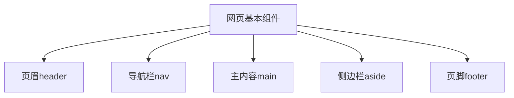
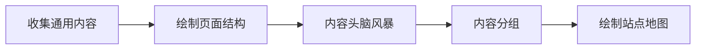

# HTML文档与网站架构

## 基本组成部分



### 语义化标签
- `<header>`: 页眉
- `<nav>`: 导航栏
- `<main>`: 主内容(每页唯一)
- `<aside>`: 侧边栏
- `<footer>`: 页脚
- `<article>`: 独立文章内容
- `<section>`: 功能分块

### 无语义标签
- `<div>`: 块级无语义元素
- `<span>`: 内联无语义元素

### 特殊元素
- `<br>`: 换行
- `<hr>`: 水平分割线(表示主题转换)

## 网站规划步骤



## 练习题

1. 补全代码,为以下HTML添加合适的语义标签:
```html
<body>
  <!-- 在此添加页眉标签 -->
    <h1>我的博客</h1>
  <!-- 结束页眉标签 -->
  
  <!-- 在此添加导航标签 -->
    <ul>
      <li><a href="#home">首页</a></li>
      <li><a href="#about">关于</a></li>
    </ul>
  <!-- 结束导航标签 -->
</body>
```

2. 分析下面的场景,选择最合适的HTML标签:
- 一篇完整的新闻报道应该用什么标签?
- 网页右侧的相关文章推荐用什么标签?
- 网站底部的版权信息用什么标签?

3. 补全代码,为诗歌添加正确的换行:
```html
<p>
  春眠不觉晓
  处处闻啼鸟
  夜来风雨声
  花落知多少
</p>
```

<details>
<summary>参考答案</summary>

1. 补全代码:
```html
<body>
  <header>
    <h1>我的博客</h1>
  </header>
  
  <nav>
    <ul>
      <li><a href="#home">首页</a></li>
      <li><a href="#about">关于</a></li>
    </ul>
  </nav>
</body>
```

2. 场景分析:
- 新闻报道: `<article>`
- 相关推荐: `<aside>` 
- 版权信息: `<footer>`

3. 诗歌换行:
```html
<p>
  春眠不觉晓<br>
  处处闻啼鸟<br>
  夜来风雨声<br>
  花落知多少
</p>
```
</details>