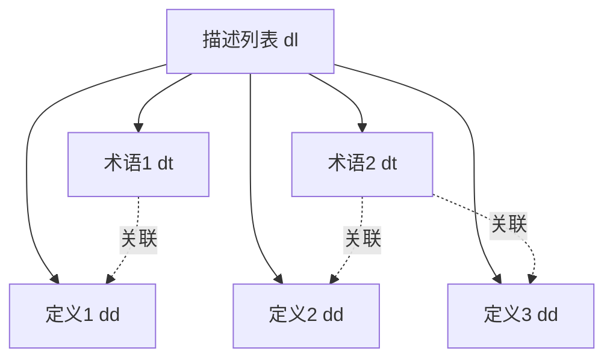
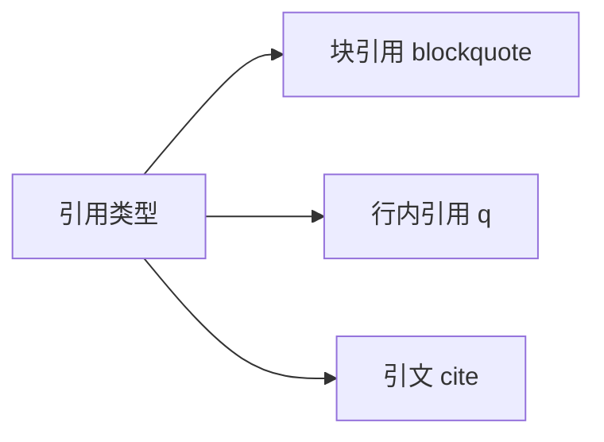
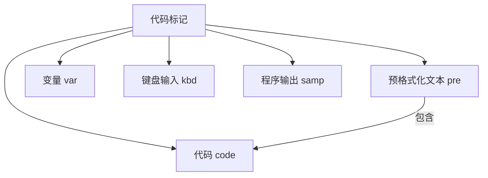
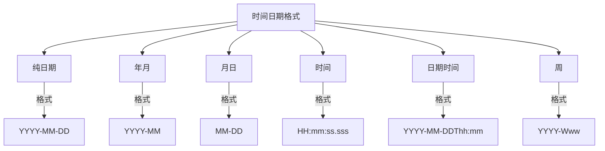

# HTML文本格式进阶

## 1. 基本概念

### 1.1 描述列表 (Description List)
- 使用`<dl>`标签创建描述列表
- `<dt>`用于描述术语(description term)
- `<dd>`用于描述定义(description definition)



### 1.2 引用元素
- 块引用：`<blockquote cite="URL">`
- 行内引用：`<q cite="URL">`
- 引文标题：`<cite>`



### 1.3 其他语义化元素
- 缩略语：`<abbr title="完整描述">`
- 联系方式：`<address>`
- 上标和下标：`<sup>` 和 `<sub>` | 例:x平方
- 代码相关：
  - `<code>`: 通用代码
  - `<pre>`: 预格式化文本
  - `<var>`: 变量
  - `<kbd>`: 键盘输入
  - `<samp>`: 程序输出
- 时间日期：`<time datetime="标准格式">`

### 1.4 代码标记详解
代码相关的标签可以更精确地标记不同类型的计算机代码内容:



使用示例:
```html
<!-- 代码块 -->
<pre><code>
function greeting() {
    console.log("Hello World!");
}
</code></pre>

<!-- 行内代码 -->
<p>HTML中不要使用<code>&lt;font&gt;</code>标签</p>

<!-- 变量名 -->
<p>函数中的<var>name</var>参数表示用户名</p>

<!-- 键盘输入 -->
<p>按下<kbd>Ctrl</kbd> + <kbd>S</kbd>保存文件</p>

<!-- 程序输出 -->
<pre><samp>Error: File not found</samp></pre>
```

### 1.5 时间日期标记详解
`<time>`元素支持多种日期时间格式:



使用示例:
```html
<!-- 完整日期 -->
<time datetime="2024-03-15">2024年3月15日</time>

<!-- 年月 -->
<time datetime="2024-03">2024年3月</time>

<!-- 时间 -->
<time datetime="15:30:00">下午3点30分</time>

<!-- 日期时间 -->
<time datetime="2024-03-15T15:30">2024年3月15日下午3点30分</time>

<!-- 带时区 -->
<time datetime="2024-03-15T15:30+08:00">北京时间2024年3月15日下午3点30分</time>

<!-- 周格式 -->
<time datetime="2024-W11">2024年第11周</time>
```

## 2. 练习题

### 练习1: 描述列表补全
补全下面的描述列表代码：
```html
<dl>
  <dt>HTML</dt>
  <!-- 在这里添加HTML的定义 -->
  <dt>CSS</dt>
  <!-- 在这里添加CSS的定义 -->
</dl>
```

### 练习2: 引用标记
将下面的文本转换为正确的引用格式：
```html
<!-- 将这句话转换为带引用源的块引用 -->
生活就像一盒巧克力，你永远不知道下一颗是什么味道。
引用源: https://example.com/quotes/forrest-gump
```

### 练习3: 时间标记
将以下日期时间转换为机器可读的格式：
```html
<!-- 将"2024年3月15日下午3点30分"转换为time标签格式 -->
2024年3月15日下午3点30分
```

<details>
<summary>参考答案</summary>

### 练习1答案:
```html
<dl>
  <dt>HTML</dt>
  <dd>超文本标记语言(HyperText Markup Language)，用于构建和呈现网页的标准标记语言。</dd>
  <dt>CSS</dt>
  <dd>层叠样式表(Cascading Style Sheets)，用于定义HTML文档样式的样式表语言。</dd>
</dl>
```

### 练习2答案:
```html
<blockquote cite="https://example.com/quotes/forrest-gump">
  <p>生活就像一盒巧克力，你永远不知道下一颗是什么味道。</p>
</blockquote>
<cite>
  <a href="https://example.com/quotes/forrest-gump">阿甘正传</a>
</cite>
```

### 练习3答案:
```html
<time datetime="2024-03-15T15:30">2024年3月15日下午3点30分</time>
```
</details>
