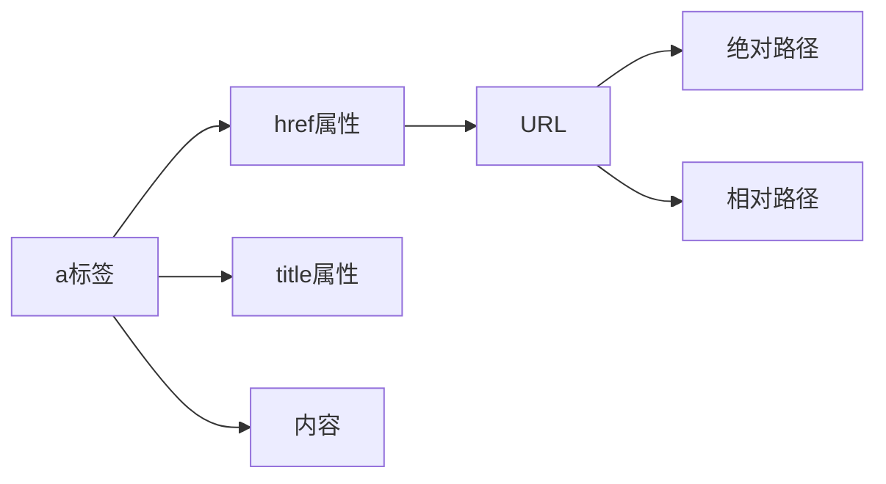
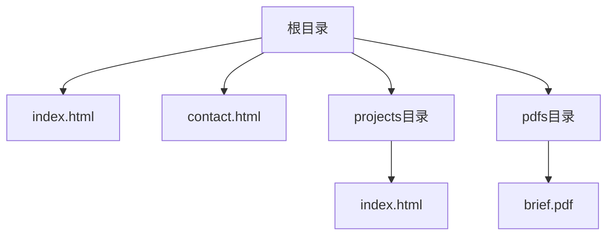

# 超链接基础

## 定义
超链接是互联网的核心功能之一,允许我们在不同文档或资源之间建立连接。通过超链接,我们可以:
- 链接到其他HTML文档
- 链接到文本文件、图片、视频等资源
- 链接到文档的特定部分
- 创建邮件链接

## 基本语法结构



## URL路径示例



## 练习题

### 1. 补全代码
已知有如下目录结构:
- root/
  - index.html
  - about/
    - team.html
    - contact.html
  - images/
    - logo.png

在 index.html 中要链接到 team.html,补全以下代码:
```html
<a href="________">团队介绍</a>
```

### 2. 实现邮件链接
要实现一个发送邮件的链接,邮件需要:
- 收件人: test@example.com 
- 主题: 测试邮件
- 正文: 你好

请补全代码:
```html
<a href="________">发送邮件</a>
```

### 3. 文档片段链接
有以下HTML结构:
```html
<h1>目录</h1>
<!-- 在这里补充代码,链接到下方的第二章 -->

<h2 id="chapter2">第二章</h2>
<p>这是第二章的内容</p>
```

请在注释处补全代码,实现点击可跳转到第二章。

<details>
<summary>参考答案</summary>

1. 链接到team.html:
```html
<a href="about/team.html">团队介绍</a>
```

2. 邮件链接:
```html
<a href="mailto:test@example.com?subject=测试邮件&body=你好">发送邮件</a>
```

3. 文档片段链接:
```html
<a href="#chapter2">跳转到第二章</a>
```
</details>