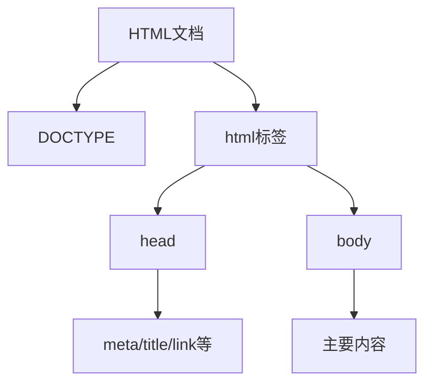

# HTML信件标记

## 基本概念

### 文档结构



### 语义化标签
- `<address>` - 用于标记地址信息
- `<strong>` - 重要文本
- `<em>` - 强调文本
- `<time>` - 时间日期
- `<abbr>` - 缩写词
- `<sub>` - 下标
- `<sup>` - 上标
- `<blockquote>` - 引用

## 练习题

### 题目1: 标记地址
请补充代码,将以下地址正确标记:
```html
北京市海淀区中关村
清华大学
邮编: 100084
```

<details><summary>参考答案</summary>

```html
<address>
北京市海淀区中关村
清华大学
邮编: 100084
</address>
```
</details>

### 题目2: 标记日期
请使用语义化标签标记以下日期:
```html
会议时间: 2024年3月15日
```

<details><summary>参考答案</summary>

```html
会议时间: <time datetime="2024-03-15">2024年3月15日</time>
```
</details>

### 题目3: 完善文档结构
请补充完整的HTML文档结构:
```html
_____ 
<html>
_____
    <meta charset="utf-8">
    <title>我的信件</title>
_____
<body>
    <h1>亲爱的朋友</h1>
    <p>这是一封信...</p>
</body>
_____
```

<details><summary>参考答案</summary>

```html
<!DOCTYPE html>
<html>
<head>
    <meta charset="utf-8">
    <title>我的信件</title>
</head>
<body>
    <h1>亲爱的朋友</h1>
    <p>这是一封信...</p>
</body>
</html>
```
</details>

### 题目4: 标记缩写词
请使用正确的标签标记以下缩写词:
```html
我正在学习_____ (Hyper Text Markup Language)和_____ (Cascading Style Sheets)。
```

<details><summary>参考答案</summary>

```html
我正在学习<abbr title="Hyper Text Markup Language">HTML</abbr>和<abbr title="Cascading Style Sheets">CSS</abbr>。
```
</details>