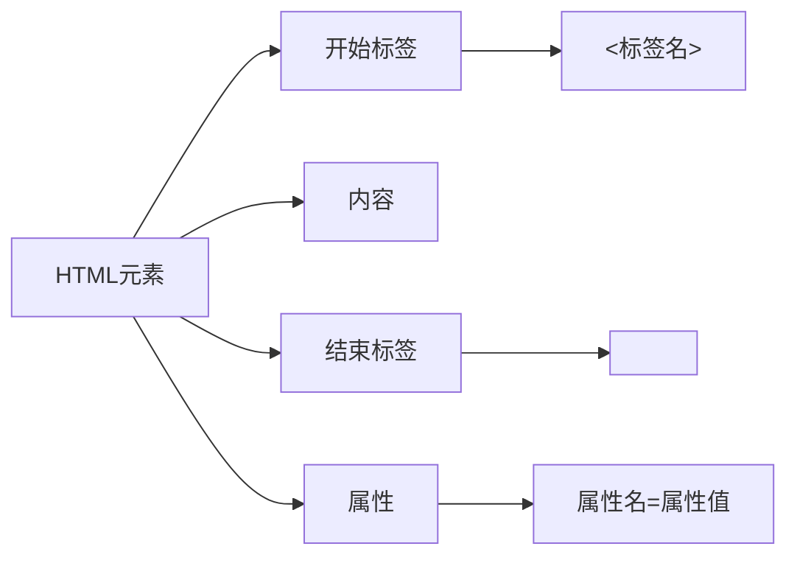
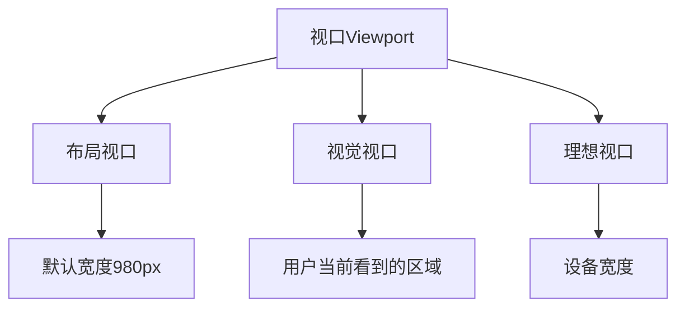
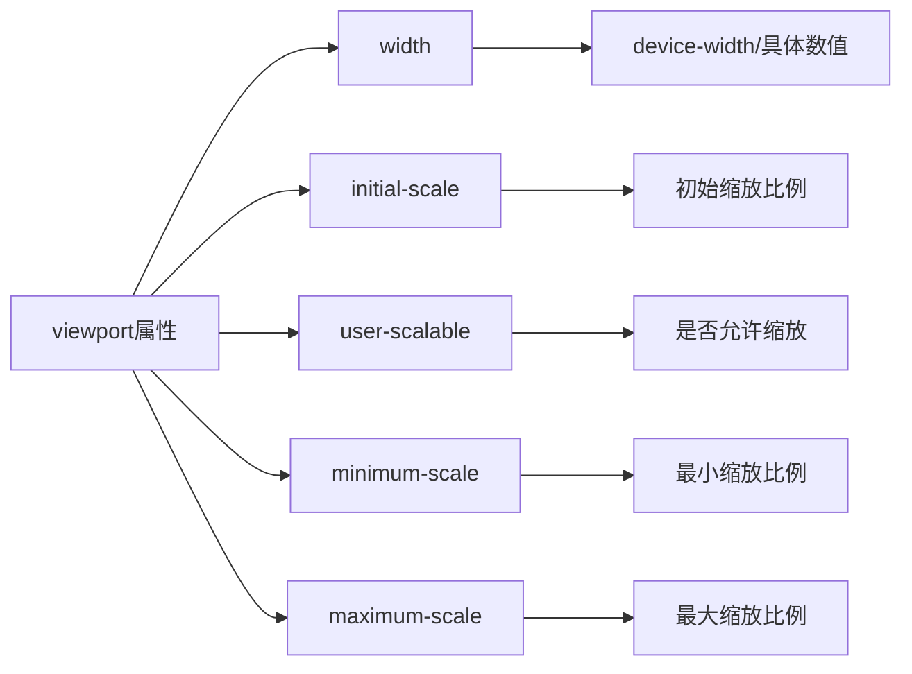
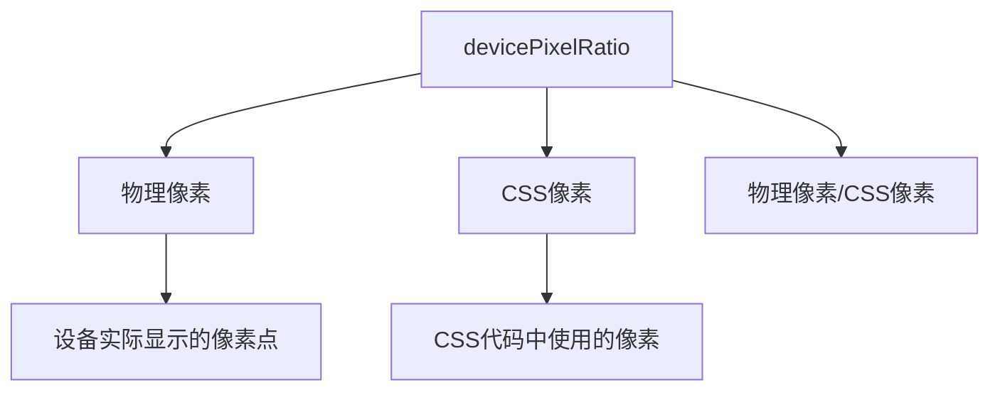
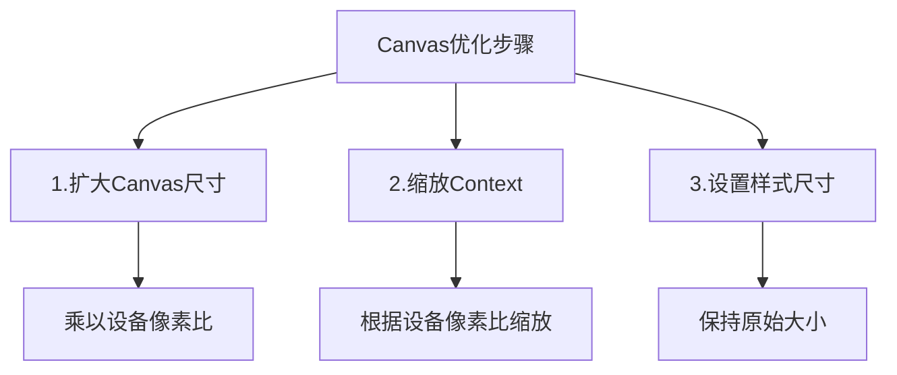
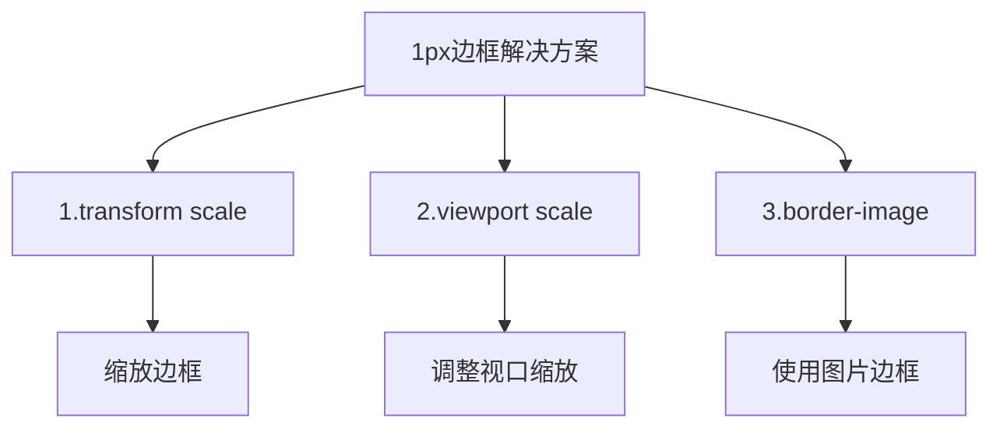

# HTML基础

HTML(HyperText Markup Language)是用于构建网页结构的标记语言。

## HTML元素结构



## 基本概念

1. **文档结构**
```html
<!DOCTYPE html>
<html>
  <head>
    <!-- 元数据 -->
  </head>
  <body>
    <!-- 页面内容 -->
  </body>
</html>
```

2. **常用元素**
- 标题: `<h1>` 到 `<h6>`
- 段落: `<p>`
- 链接: `<a href="url">`
- 图片: ``
- 列表: 
  - 无序列表: `<ul>` + `<li>`
  - 有序列表: `<ol>` + `<li>`

3. **属性**
- 属性提供元素的额外信息
- 格式: `属性名="属性值"`
- 例如: `class="header"`, `id="main"`

## 练习题

### 1. 补全代码
```javascript
// 补全代码,将HTML字符串转换为DOM元素
function createElementFromHTML(htmlString) {
  // 在这里补充代码,将htmlString转换为DOM元素并返回
  // 提示: 使用 document.createElement 和 innerHTML
}

// 测试用例
console.log(createElementFromHTML('<div>Hello</div>'))
```

### 2. 属性操作
```javascript
// 补全代码,实现为元素添加多个class的函数
function addClasses(element, ...classNames) {
  // 在这里补充代码,将classNames中的类名都添加到element中
  // 提示: 使用classList
}

// 测试用例
const div = document.createElement('div');
addClasses(div, 'class1', 'class2', 'class3');
console.log(div.className); // 应输出: "class1 class2 class3"
```

### 3. DOM结构验证
```javascript
// 补全代码,验证HTML标签是否正确闭合
function isValidHTML(htmlString) {
  // 在这里补充代码,判断htmlString中的标签是否正确闭合
  // 提示: 使用栈结构处理开闭标签
}

// 测试用例
console.log(isValidHTML('<div><p>Hello</p></div>')); // true
console.log(isValidHTML('<div><p>Hello</div></p>')); // false
```

<details>
<summary>参考答案</summary>

1. HTML转DOM元素
```javascript
function createElementFromHTML(htmlString) {
  const div = document.createElement('div');
  div.innerHTML = htmlString;
  return div.firstChild;
}
```

2. 添加多个class
```javascript
function addClasses(element, ...classNames) {
  element.classList.add(...classNames);
}
```

3. HTML标签闭合验证
```javascript
function isValidHTML(htmlString) {
  const stack = [];
  const tagRegex = /<\/?([a-z][a-z0-9]*)\b[^>]*>/gi;
  let match;
  
  while ((match = tagRegex.exec(htmlString))) {
    const [fullTag, tagName] = match;
    if (fullTag.startsWith('</')) {
      if (stack.pop() !== tagName) return false;
    } else {
      if (!fullTag.endsWith('/>')) stack.push(tagName);
    }
  }
  
  return stack.length === 0;
}
```
</details>

# Viewport视口详解

viewport(视口)是移动端网页布局的重要概念。它控制着网页在移动设备上的显示方式。

## 视口类型



### 1. 布局视口(Layout Viewport)
- 默认宽度通常为980px
- 网页会被缩小以适应屏幕
- 用户需要缩放才能看清内容

### 2. 视觉视口(Visual Viewport)
- 用户实际看到的区域
- 大小随用户缩放变化
- 决定内容在屏幕上的实际显示大小

### 3. 理想视口(Ideal Viewport)
- 为移动设备优化的视口
- 宽度等于设备屏幕宽度
- 无需缩放即可正常阅读

## Viewport Meta标签

### 基本语法
```html
<meta name="viewport" content="width=device-width, initial-scale=1.0">
```

### 属性说明


### 常用设置示例

```html
<!-- 基本响应式设置 -->
<meta name="viewport" content="width=device-width, initial-scale=1.0">

<!-- 禁止用户缩放 -->
<meta name="viewport" content="width=device-width, initial-scale=1.0, user-scalable=no">

<!-- 限制缩放范围 -->
<meta name="viewport" content="width=device-width, initial-scale=1.0, minimum-scale=1.0, maximum-scale=2.0">
```

## 最佳实践

1. **始终设置viewport**
- 确保移动端正确显示
- 防止内容被缩小

2. **避免固定宽度**
- 使用相对单位(%, rem, em)
- 适应不同屏幕大小

3. **合理使用缩放限制**
- 考虑无障碍需求
- 不建议完全禁用缩放

## 练习题

```javascript
// 编写函数检测当前设备viewport宽度是否等于设备宽度
function isIdealViewport() {
  // 补充代码检测是否为理想视口
  // 提示: 比较window.innerWidth和screen.width
}

// 测试用例
console.log(isIdealViewport());
```

<details>
<summary>参考答案</summary>

```javascript
function isIdealViewport() {
  // 考虑设备像素比
  const devicePixelRatio = window.devicePixelRatio || 1;
  const screenWidth = screen.width * devicePixelRatio;
  return Math.abs(window.innerWidth * devicePixelRatio - screenWidth) < 1;
}
```
</details>


# devicePixelRatio设备像素比



## 基本概念
- 物理像素: 设备屏幕实际的像素点数
- CSS像素: 开发时使用的逻辑像素
- devicePixelRatio = 物理像素 / CSS像素

## 常见值
- 普通屏幕: 1 (1个CSS像素对应1个物理像素)
- Retina屏幕: 2 (1个CSS像素对应4个物理像素)
- 部分高清屏: 3 或更高

## 代码示例
```javascript
// 获取设备像素比
const dpr = window.devicePixelRatio;

// 根据设备像素比选择图片
function getImageUrl(basicUrl) {
  const dpr = window.devicePixelRatio || 1;
  return basicUrl.replace('.jpg', `@${dpr}x.jpg`);
}
```

## 实际应用
- 高清图片适配
- Canvas绘图优化
- 移动端1px边框问题解决

## 练习题
```javascript
// 编写函数,根据设备像素比返回最适合的图片URL
function getOptimalImageUrl(imageUrls) {
  // imageUrls是一个对象,包含不同分辨率的图片URL
  // 例如: {1: 'img.jpg', 2: 'img@2x.jpg', 3: 'img@3x.jpg'}
  // 返回最接近当前设备像素比的图片URL
}
```

<details>
<summary>参考答案</summary>

```javascript
function getOptimalImageUrl(imageUrls) {
  const dpr = window.devicePixelRatio || 1;
  const availableRatios = Object.keys(imageUrls).map(Number);
  
  // 找到最接近的像素比
  const optimalRatio = availableRatios.reduce((prev, curr) => {
    return Math.abs(curr - dpr) < Math.abs(prev - dpr) ? curr : prev;
  });
  
  return imageUrls[optimalRatio];
}
```
</details>


# Canvas绘图优化与1px边框问题详解

## Canvas绘图优化

当在高清屏(Retina屏幕)上绘制Canvas时,需要考虑设备像素比来避免模糊。



### 代码示例
```javascript
function createHDCanvas(width, height) {
  const canvas = document.createElement('canvas');
  const ctx = canvas.getContext('2d');
  const dpr = window.devicePixelRatio || 1;
  
  // 设置Canvas的实际尺寸
  canvas.width = width * dpr;
  canvas.height = height * dpr;
  
  // 设置Canvas的样式尺寸
  canvas.style.width = width + 'px';
  canvas.style.height = height + 'px';
  
  // 根据dpr缩放context
  ctx.scale(dpr, dpr);
  
  return { canvas, ctx };
}

// 使用示例
const { canvas, ctx } = createHDCanvas(200, 100);
ctx.fillStyle = 'red';
ctx.fillRect(0, 0, 100, 50); // 绘制清晰的矩形
```

## 1px边框问题

在高清屏上,1px的CSS边框实际上会被渲染成2px或3px的物理像素,导致边框看起来比较粗。



### 解决方案1: transform scale
```css
.border-1px {
  position: relative;
}
.border-1px::after {
  content: '';
  position: absolute;
  left: 0;
  bottom: 0;
  width: 100%;
  height: 1px;
  background: #000;
  transform: scaleY(0.5);
  transform-origin: 0 0;
}

/* 根据dpr优化 */
@media (-webkit-min-device-pixel-ratio: 2) {
  .border-1px::after {
    transform: scaleY(0.5);
  }
}
@media (-webkit-min-device-pixel-ratio: 3) {
  .border-1px::after {
    transform: scaleY(0.333);
  }
}
```

### 解决方案2: viewport scale
```html
<script>
  const scale = 1 / window.devicePixelRatio;
  const viewport = document.querySelector('meta[name="viewport"]');
  viewport.setAttribute('content', `width=device-width,initial-scale=${scale},maximum-scale=${scale},minimum-scale=${scale}`);
</script>
```

### 解决方案3: border-image
```css
.border-1px {
  border-width: 1px 0;
  border-style: solid;
  border-image: url(../img/border.png) 2 0 stretch;
}
```

## 练习题
```javascript
// 实现一个函数,根据设备像素比动态设置1px边框
function setOptimalBorder(element) {
  // 补充代码,为元素设置最优的1px边框
  // 可以使用上述任意方案
}
```

<details>
<summary>参考答案</summary>

```javascript
function setOptimalBorder(element) {
  const dpr = window.devicePixelRatio || 1;
  
  // 使用transform scale方案
  element.style.position = 'relative';
  
  const border = document.createElement('div');
  border.style.cssText = `
    position: absolute;
    left: 0;
    bottom: 0;
    width: 100%;
    height: 1px;
    background: #000;
    transform: scaleY(${1/dpr});
    transform-origin: 0 0;
  `;
  
  element.appendChild(border);
  return border;
}
```

</details>