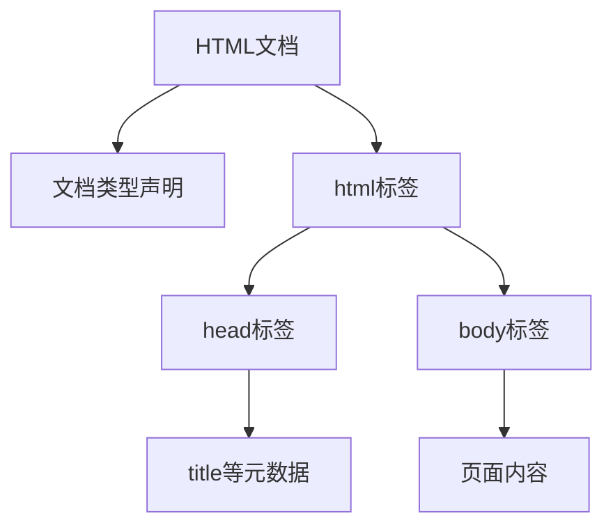
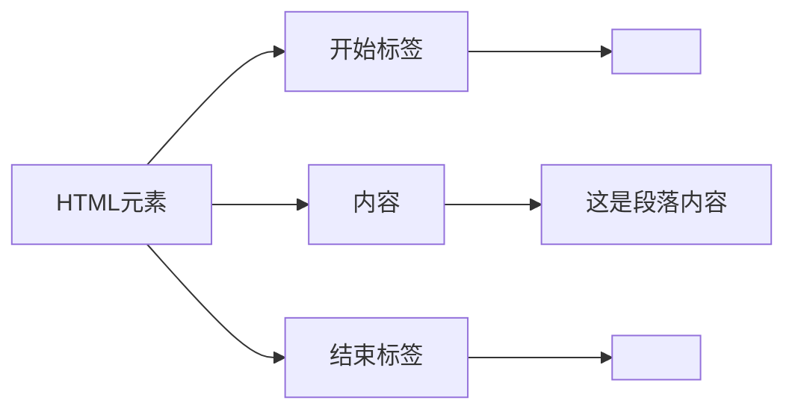
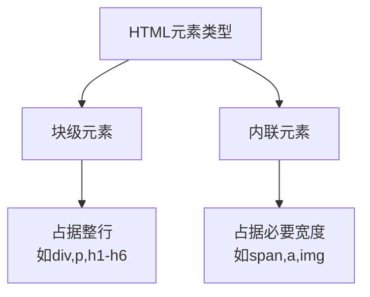

# HTML基础知识

## 什么是HTML?
HTML(HyperText Markup Language)是一种标记语言,不是编程语言。它的主要作用是告诉浏览器如何构造网页。



## HTML元素的基本组成



## 块级元素vs内联元素



## 常用标签

- 标题: `h1` - `h6`
- 段落: `p`
- 链接: `a`
- 图片: `img`
- 列表: 
  - 无序列表: `ul` + `li`
  - 有序列表: `ol` + `li`
- 表格: `table`, `tr`, `td`
- 表单: `form`, `input`, `button`

## 练习题

### 1. 补全代码
```html
<div>
  <!-- 在下面添加一个一级标题,内容为"Welcome" -->
  
  <!-- 在下面添加一个段落,内容为"This is a paragraph" -->
  
</div>
```

### 2. 创建超链接
```html
<!-- 补全代码,创建一个链接指向 https://www.google.com,显示文字为"Visit Google" -->
<p>
  
</p>
```

### 3. 表单验证
```html
<!-- 补全代码,创建一个必填的邮箱输入框,placeholder为"Enter your email" -->
<form>
  
</form>
```

### 4. JavaScript DOM操作题
```javascript
// 补全代码,获取页面上所有的段落元素
function getAllParagraphs() {
  
}
```

### 5. 图片显示
```html
<!-- 补全代码,添加一个图片,源地址为"image.jpg",alt文本为"A beautiful image" -->
<div>
  
</div>
```

<details>
<summary>参考答案</summary>

1. 补全代码:
```html
<div>
  <h1>Welcome</h1>
  <p>This is a paragraph</p>
</div>
```

2. 创建超链接:
```html
<p>
  <a href="https://www.google.com">Visit Google</a>
</p>
```

3. 表单验证:
```html
<form>
  <input type="email" required placeholder="Enter your email">
</form>
```

4. JavaScript DOM操作:
```javascript
function getAllParagraphs() {
  return document.getElementsByTagName('p');
}
```

5. 图片显示:
```html
<div>
  
</div>
```

</details>