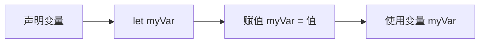
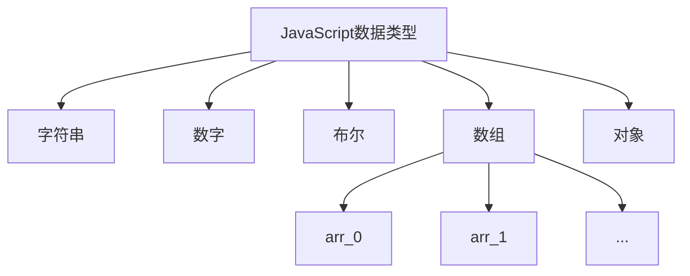
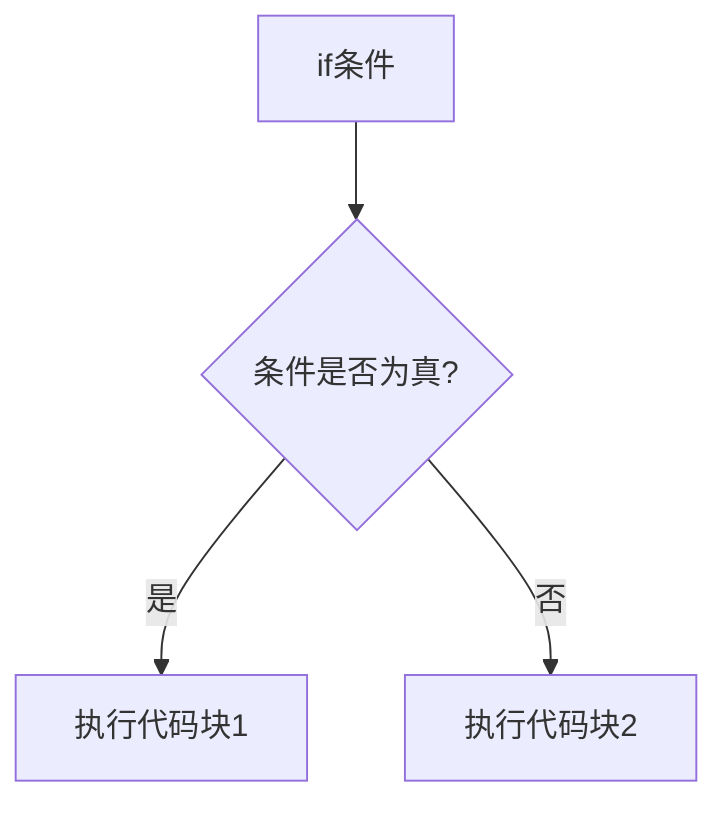

# JavaScript基础

## 定义
JavaScript是一门为网站添加交互性的编程语言,由布兰登·艾克发明。它可以:
- 响应用户操作(点击、输入等)
- 动态修改页面内容和样式
- 实现动画效果
- 处理数据等

## 核心概念

### 1. 变量
变量是存储值的容器。使用let关键字声明:



### 2. 数据类型


### 3. 运算符
- 算术运算符: +, -, *, /
- 赋值运算符: =
- 比较运算符: ===, !==
- 逻辑运算符: !, &&, ||

### 4. 条件语句


### 5. 函数
函数是可重用的代码块,可以接收参数并返回结果。

## 练习题

### 1. 变量练习
补全代码,声明一个变量name并赋值为你的名字:
```javascript
// 在这里补充代码
```

### 2. 条件判断
补全代码,判断age是否大于18,如果是则输出"成年人",否则输出"未成年":
```javascript
let age = 20;
// 在这里补充代码
```

### 3. 函数练习
补全函数,实现两个数相加:
```javascript
function add(a, b) {
  // 在这里补充代码
}
```

<details>
<summary>参考答案</summary>

1. 变量练习:
```javascript
let name = "张三";
```

2. 条件判断:
```javascript
if(age > 18) {
  console.log("成年人");
} else {
  console.log("未成年");
}
```

3. 函数练习:
```javascript
function add(a, b) {
  return a + b;
}
```
</details>