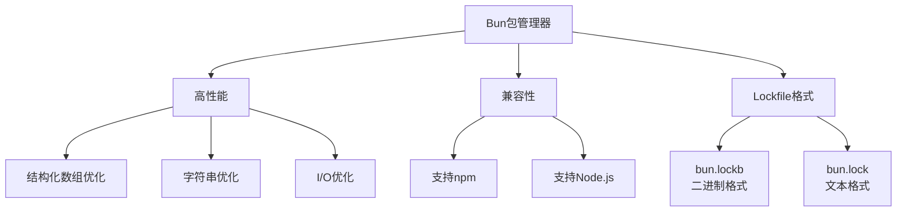
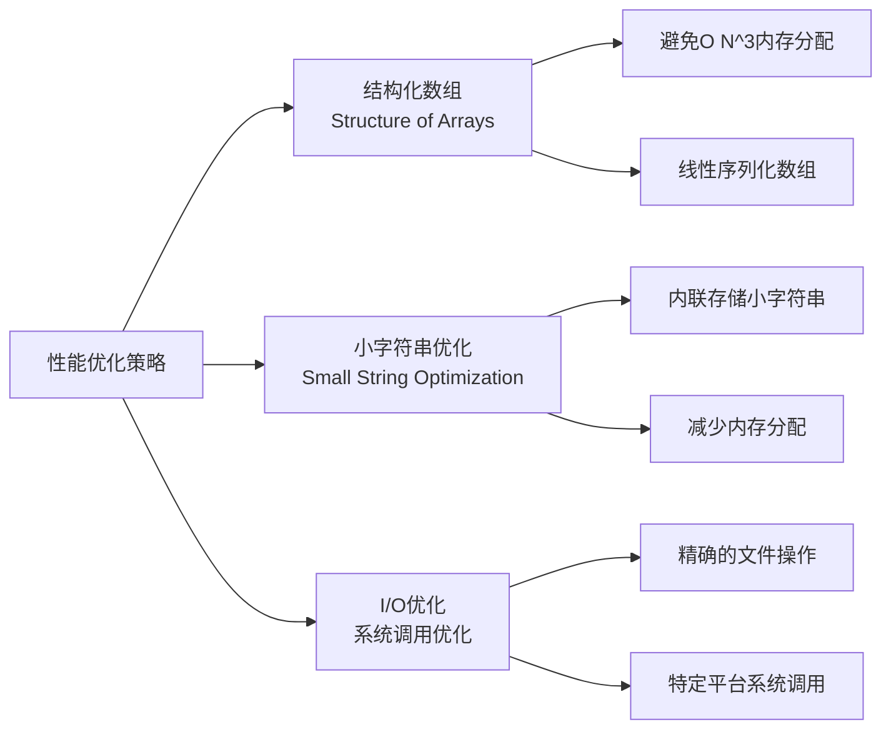

### Bun简介
Bun是一个快速的npm兼容包管理器，可以与Node.js或Bun运行时一起使用。最新版本(v1.1.39)引入了文本格式的lockfile，以解决之前二进制lockfile带来的一些问题。
### 核心特点



### 性能优化关键点



### 练习题
1. 问题：为什么Bun要从二进制lockfile转向文本格式的lockfile？列出主要原因。
2. 问题：解释Bun中"Structure of Arrays"的优化原理，并说明为什么这种方式比传统的对象存储更快。
3. 代码题：基于文章中的示例，实现一个简化版的Package管理系统，包含快速和慢速两种实现方式。
4. 问题：Bun声称其性能提升不仅仅依赖于二进制lockfile格式，请解释至少三个其他的性能优化方面。
<details>
<summary>参考答案</summary>

1. 主要原因：
   - 二进制格式难以在PR中审查
   - 合并冲突难以解决
   - 工具链难以读取二进制格式
   - GitHub等平台无法直接显示差异
  
2. Structure of Arrays优化原理：
   - 传统方式：每个包对象独立分配内存，包含所有相关数据
   - SOA方式：使用统一的数组存储相同类型的数据，通过索引引用
   - 优势：减少内存碎片，提高缓存命中率，降低内存分配开销
  
3. 代码示例：

```typescript
// 快速实现
interface FastPackageSystem {
    packages: Array<{
        nameIndex: number;
        versionIndex: number;
        dependenciesStart: number;
        dependenciesCount: number;
    }>;
    strings: string[];
    dependencies: number[];
}

// 慢速实现
interface SlowPackageSystem {
    packages: Array<{
        name: string;
        version: string;
        dependencies: Record<string, string>;
    }>;
}
```

4. 性能优化方面：
   - 小字符串优化：内联存储小字符串，避免额外的内存分配
   - 精确的I/O操作：使用特定平台的系统调用，减少不必要的文件操作
   - 结构化数组：使用连续内存布局，提高数据访问效率
   - 避免重复计算：通过索引复用已有数据
</details>