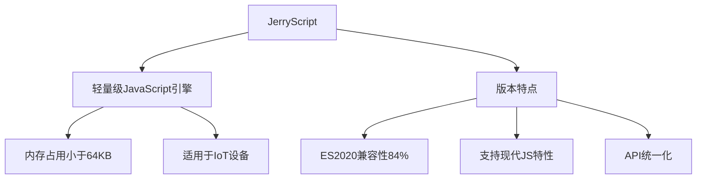

# JerryScript 3.0 学习指南

## 简介

JerryScript 是一个轻量级的 JavaScript 引擎，专为物联网和嵌入式系统设计。3.0 版本带来了重大更新，提升了对现代 JavaScript 特性的支持。



## 核心特点

### 1. 性能与兼容性
- ES2020 规范测试覆盖率达到 84%
- Kangax 兼容性从 45% 提升到 70%
- 支持在资源受限设备运行

### 2. 新增语言特性
- 动态导入（Dynamic Import）
- 类字段相关功能（Class Fields）
- 逻辑赋值运算符（&&=, ||=, ??=）
- 可选链操作符（?.）
- 私有类方法
- 静态类字段

### 3. 新增内置方法
- Atomics 支持
- Object.hasOwn
- Promise.allSettled 和 Promise.Any
- SharedArrayBuffer

## 练习题

### 1. 基础概念
```c
// 问题：JerryScript的主要应用场景是什么？为什么不直接使用V8引擎？
```

### 2. 特性支持
```javascript
// 问题：以下代码在JerryScript 3.0中是否可以运行？为什么？

class Calculator {
    #value = 0;
    static count = 0;
    
    constructor() {
        Calculator.count++;
    }
}
```

### 3. 嵌入式开发
```c
// 问题：如何在嵌入式设备中集成JerryScript并运行以下JavaScript代码？
const result = await import('./module.js');
```

<details>
<summary>参考答案</summary>

1. 基础概念
```
JerryScript主要应用于：
- IoT设备
- 嵌入式系统
- 资源受限环境

不使用V8的原因：
- V8内存占用大（数百MB级别）
- V8二进制文件体积大
- JerryScript专门优化，仅需64KB RAM
```

2. 特性支持
```javascript
// 此代码可以在JerryScript 3.0中运行
// 因为3.0版本支持：
// 1. 私有类字段（#value）
// 2. 静态类字段（static count）
// 3. 类构造器
```

3. 嵌入式开发
```c
#include "jerryscript.h"

// 初始化JerryScript引擎
jerry_init(JERRY_INIT_EMPTY);

// 注册模块加载器
jerry_module_resolver_t resolver = {
    .get_native_module = my_module_resolver
};
jerry_set_module_resolver(&resolver);

// 执行包含动态导入的代码
const jerry_char_t script[] = "const result = await import('./module.js');";
jerry_eval_async(script, sizeof(script) - 1, JERRY_PARSE_MODULE);

// 清理
jerry_cleanup();
```

</details>