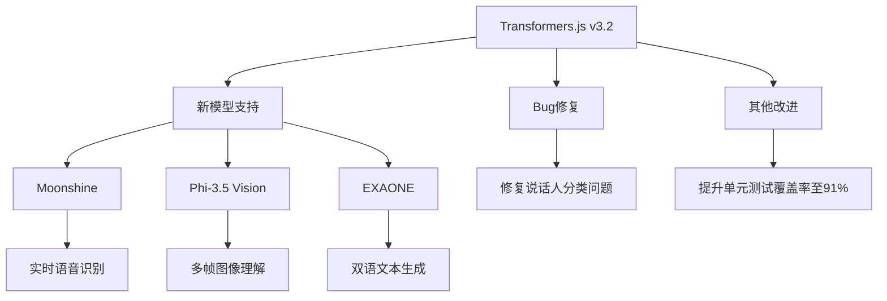

# Transformers.js v3.2 简介

## 主要特性

### 1. 新增模型支持

- **Moonshine**: 针对资源受限设备优化的语音识别模型
  - 适用于实时转录和语音命令识别
  - 支持浏览器端运行
- **Phi-3.5 Vision**: 轻量级多模态模型
  - 支持多帧图像理解和推理
  - 适合图像内容分析和描述
- **EXAONE**: 双语生成模型
  - 基于指令微调的生成模型
  - 支持英语和韩语

### 2. 主要改进
- 修复了说话人分类相关问题
- 提升了单元测试覆盖率(从84%提升到91%)

## 思考题

1. 语音识别应用场景思考:
如何利用 Moonshine 模型开发一个实时会议记录系统？需要考虑哪些技术要点？

2. 多模态分析问题:
设计一个使用 Phi-3.5 Vision 的电商平台商品图片审核系统，需要处理哪些关键问题？

3. 双语生成应用:
如何利用 EXAONE 模型开发一个英韩互译的即时通讯助手？有哪些技术难点？

4. 性能优化思考:
在资源受限的移动设备上运行 Moonshine 模型，需要采取哪些优化措施？

参考答案

1. 会议记录系统技术要点:
- 音频流实时处理
- 说话人分离
- 降噪处理
- 实时转写与存储
- 会议纪要自动生成

2. 商品图片审核系统关键点:
- 图片预处理和规范化
- 违规内容识别
- 商品主体提取
- 批量处理能力
- 审核结果存储与反馈

3. 即时通讯助手技术难点:
- 实时响应优化
- 上下文理解
- 翻译准确性
- 文化差异处理
- 用户交互设计

4. 移动端优化措施:
- 模型量化
- 增量更新
- 缓存策略
- 计算任务调度
- 电量优化

