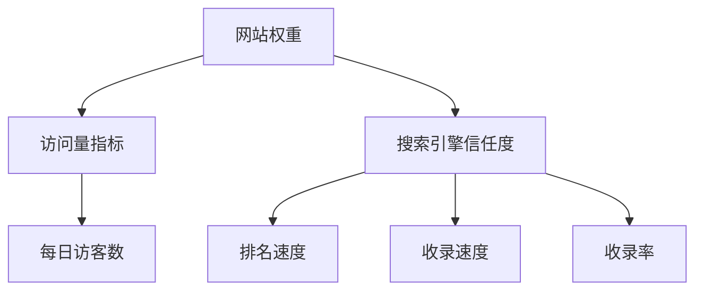

# 网站权重详解

## 什么是网站权重?

网站权重(PR值)是搜索引擎对网站的信任度评分。最早源自Google的页面级别(PageRank)算法,目前各大平台都有自己的权重计算方式。



## 权重等级与访问量对应关系


## 提升权重的方法

1. 增加有效排名
2. 获得高指数关键词排名
3. 提升用户留存
4. 注重网站转化率

## 注意事项

- 百度官方声明从未有过权重值概念
- 各检测平台的权重计算方法不同
- 不要购买虚假权重
- 重点关注实际转化而非权重数值

## 练习题

### 题目1: 计算网站等级
根据每日访客数计算网站权重等级。

```javascript
function calculateWebsiteRank(dailyVisitors) {
  // 补充代码:根据访客数返回权重等级(0-9)
}
```

<details>
<summary>参考答案</summary>

```javascript
function calculateWebsiteRank(dailyVisitors) {
  if (dailyVisitors < 1) return 0;
  if (dailyVisitors < 100) return 1;
  if (dailyVisitors < 500) return 2;
  if (dailyVisitors < 1000) return 3;
  if (dailyVisitors < 10000) return 4;
  if (dailyVisitors < 50000) return 5;
  if (dailyVisitors < 100000) return 6;
  if (dailyVisitors < 500000) return 7;
  if (dailyVisitors < 1000000) return 8;
  return 9;
}
```
</details>

### 题目2: 判断是否为异常流量
检测网站流量是否存在作弊嫌疑。

```javascript
function isAbnormalTraffic(yesterdayVisitors, todayVisitors) {
  // 补充代码:如果今天的访客数超过昨天的3倍,则视为异常
}
```

<details>
<summary>参考答案</summary>

```javascript
function isAbnormalTraffic(yesterdayVisitors, todayVisitors) {
  return todayVisitors > yesterdayVisitors * 3;
}
```
</details>

### 题目3: 计算网站健康度
根据用户停留时间评估网站健康度。

```javascript
function calculateWebsiteHealth(avgStayTime, bounceRate) {
  // 补充代码:
  // avgStayTime单位为秒,bounceRate为跳出率(0-1)
  // 返回网站健康度评分(0-100)
}
```

<details>
<summary>参考答案</summary>

```javascript
// 不同类型网站的推荐基准值
const STAY_TIME_BENCHMARK = {
    news: 180,     // 新闻网站
    ecommerce: 300,// 电商网站
    education: 600,// 教育网站
    blog: 240      // 博客
};

function calculateWebsiteHealth(avgStayTime, bounceRate, siteType = 'news') {
    const benchmark = STAY_TIME_BENCHMARK[siteType] || 180;
    const stayScore = Math.min(avgStayTime / benchmark * 50, 50);
    const bounceScore = (1 - bounceRate) * 50;
    return Math.round(stayScore + bounceScore);
}
```


</details>