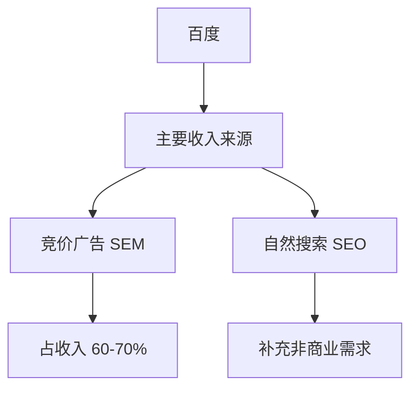
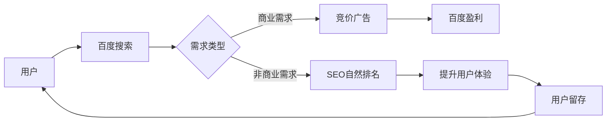

# 百度SEO核心运营思维

## 核心概念

### 百度的商业模式


### SEO与百度的共生关系


## 关键要点

1. 百度占据搜索引擎市场70%-80%的份额
2. 用户体验是百度的核心运营思维
3. SEO需要满足用户需求才能获得好的排名
4. 百度算法更新都是基于用户体验

## 练习题

### 1. 概念理解题
请问:为什么说SEO和百度是共生关系？

### 2. 实践应用题
假设你是一个SEO优化师,现在需要为一个手机使用教程网站做优化,请问应该从哪些方面入手？

### 3. 编程实践题
完成以下代码,实现一个简单的用户体验评分系统:

```javascript
function calculateUserExperience(params) {
    const {loadTime, contentQuality, userInteraction} = params;
    // 补充代码：根据加载时间(loadTime)、内容质量(contentQuality)、用户互动(userInteraction)计算总分
    // 要求：loadTime越小越好(满分40分)，contentQuality和userInteraction是0-30的得分
    // 返回总分(0-100)
}
```

### 4. 应用思考题
当用户搜索"如何开启手机飞行模式"时,为什么这个关键词适合做SEO而不适合做SEM？

<details>
<summary>参考答案</summary>

1. 概念理解题答案：
- 百度需要SEO来满足非商业性搜索需求
- SEO需要百度的流量来获得展示机会
- 双方互相依赖,共同为用户提供更好的体验

2. 实践应用题答案：
- 优化页面加载速度
- 提供清晰的教程步骤和配图
- 增加用户互动功能(如评论)
- 确保内容的实用性和准确性
- 做好移动端适配

3. 编程实践题答案：
```javascript
function calculateUserExperience(params) {
    const {loadTime, contentQuality, userInteraction} = params;
    const loadTimeScore = Math.max(0, 40 - loadTime * 2); // 假设加载时间每秒扣2分
    return loadTimeScore + contentQuality + userInteraction;
}
```

4. 应用思考题答案：
- 这是一个信息查询需求,用户只想获取答案
- 没有直接的商业转化价值
- 用户不太可能为这类信息付费
- 通过SEO提供优质答案可以提升用户体验
</details>