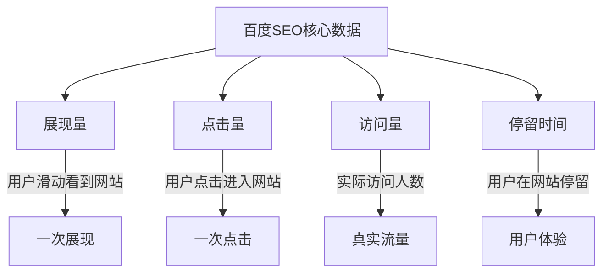

# 百度SEO核心数据指标

## 四大核心指标


### 1. 展现量
- 定义: 用户搜索后看到(展示)你的网站的次数
- 特点: 展现量高说明排名好,一般前三名占据70%流量

### 2. 点击量
- 定义: 用户点击进入你的网站的次数
- 计算: 同一用户多次点击都计入总点击量

### 3. 点击率
- 定义: 点击率 = 点击次数 / 展示量
- 意义: 反映网站标题吸引力,影响排名

### 4. 访问量
- 定义: 实际访问网站的用户数
- 特点: 反映真实流量

### 5. 停留时间与跳出率
- 停留时间: 用户在网站的停留时长
- 跳出率: 立即离开的访客数/总访客数
- 例如: 1000访客中100人立即离开,跳出率为10%

## 练习题

### 1. 点击率计算
补全以下代码,计算点击率:

```javascript
function calculateClickRate(clicks, impressions) {
    // 补全代码,计算点击率(点击次数/展示量)
}
```

### 2. 跳出率计算
补全以下代码,计算跳出率:

```javascript
function calculateBounceRate(totalVisitors, immediateLeaves) {
    // 补全代码,计算跳出率(立即离开人数/总访客数)
}
```

### 3. 数据分析
补全以下代码,判断网站SEO表现:

```javascript
function analyzeSEO(clickRate, bounceRate) {
    // 补全代码
    // 当点击率>0.3 且 跳出率<0.2时返回"优秀"
    // 当点击率>0.2 且 跳出率<0.3时返回"良好"
    // 其他情况返回"需要改进"
}
```

<details>
<summary>参考答案</summary>

```javascript
// 1. 点击率计算
function calculateClickRate(clicks, impressions) {
    return clicks / impressions;
}

// 2. 跳出率计算
function calculateBounceRate(totalVisitors, immediateLeaves) {
    return immediateLeaves / totalVisitors;
}

// 3. 数据分析
function analyzeSEO(clickRate, bounceRate) {
    if (clickRate > 0.3 && bounceRate < 0.2) {
        return "优秀";
    } else if (clickRate > 0.2 && bounceRate < 0.3) {
        return "良好";
    }
    return "需要改进";
}
```
</details>