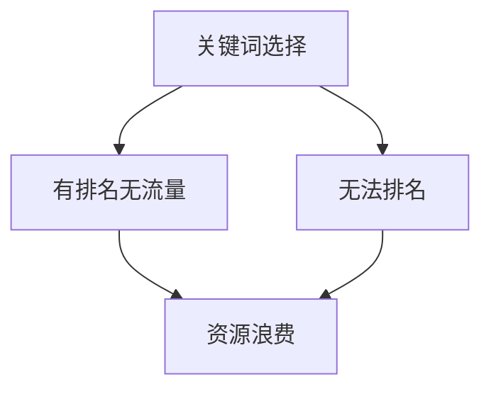
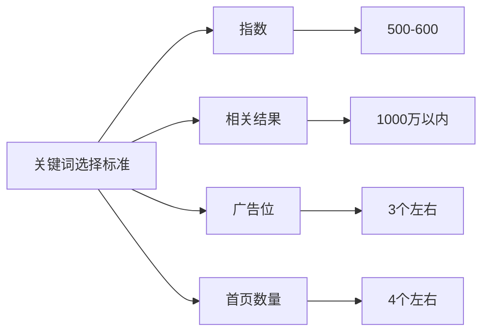

# SEO关键词选择技巧

## 什么是关键词?
关键词是用户在搜索引擎中输入的检索词,也是网站优化的目标词。例如,如果运营空压机网站,那么"空压机"就可能是一个关键词。

## 为什么关键词选择很重要?
错误的关键词选择可能导致两种现象:
1. 有排名无流量 - 网站排在首页但没有用户咨询
2. 无法排名 - 长期无法获得理想排名位置




## 关键词选择的四大标准

### 1. 指数
- 定义: 搜索引擎统计的用户搜索量
- 建议范围: 新站建议选择500-600左右的指数
- 特点: 指数越高,竞争越激烈

### 2. 相关结果
- 定义: 搜索引擎显示的相关页面数量
- 建议范围: 1000万以内
- 特点: 数量越大,竞争越激烈

### 3. 广告位
- 定义: 付费推广位置的数量
- 建议数量: 3个左右
- 意义: 反映关键词的商业价值

### 4. 首页数量
- 定义: 使用网站首页参与排名的数量
- 建议范围: 4个左右
- 特点: 反映竞争对手对该关键词的重视程度




## 练习题

1. 给定以下数据,判断这个关键词是否适合新站优化:
- 指数: 550
- 相关结果: 800万
- 广告位: 3个
- 首页数量: 5个

<details>
<summary>参考答案</summary>

这个关键词基本适合,原因如下:
- 指数在500-600范围内 ✓
- 相关结果小于1000万 ✓
- 广告位正好3个 ✓
- 首页数量接近4个 ≈
</details>

2. 完成以下代码,实现一个简单的关键词评分系统:
```javascript
function scoreKeyword(index, relatedResults, adPositions, homepageCount) {
    let score = 0;
    // 补充代码:根据指数评分(500-600之间得10分,否则0分)
    
    if(relatedResults <= 10000000) score += 10;
    if(adPositions === 3) score += 10;
    if(homepageCount <= 4) score += 10;
    return score;
}
```

<details>
<summary>参考答案</summary>

```javascript
if(index >= 500 && index <= 600) score += 10;
```
</details>

3. 判断URL是否为首页URL:

<details>
<summary>参考答案</summary>

```javascript
function isHomePage(url) {
    try {
        // 使用URL对象解析更安全
        const urlObj = new URL(url);
        // 判断路径是否仅为 '/' 或为空
        return urlObj.pathname === '/' || urlObj.pathname === '';
    } catch(e) {
        return false; // URL格式无效
    }
}
```

测试示例:
```javascript
console.log(isHomePage('https://example.com')); // true
console.log(isHomePage('https://example.com/')); // true
console.log(isHomePage('https://example.com/page')); // false
console.log(isHomePage('https://example.com/blog/')); // false
```

原来的解决方案 `!url.split('//')[1].includes('/')` 存在以下问题:
1. 不能处理无效的URL格式
2. 会误判 `https://example.com/` 为非首页
3. 没有考虑URL中可能包含的查询参数和hash

使用 URL API 可以更准确地解析URL结构。
</details>