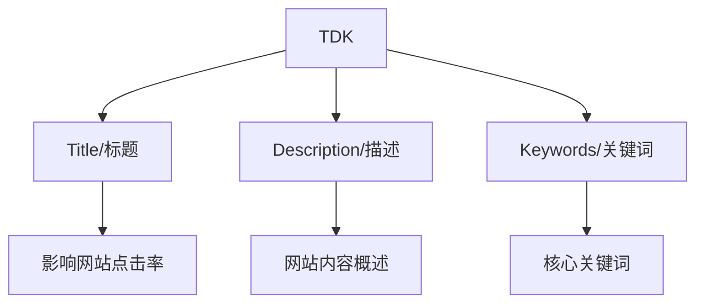

# 网站TDK优化指南

## 什么是TDK?
TDK是网站优化中的三个重要元素:
- T (Title): 网站标题
- D (Description): 网站描述
- K (Keywords): 关键词



## TDK的重要性
- 在搜索引擎结果页面中直接展示
- 占据网页评分的40%权重
- 如果TDK中没有目标关键词,几乎不会有排名

## Title标题的正确写法
1. 包含目标排名关键词
2. 通常使用3-4个关键词
3. 基本格式: `关键词1-关键词2-关键词3-品牌词`
4. 高级写法: 将关键词组合成通顺的句子

## 如何查看网站TDK
1. 使用浏览器插件
2. 查看网页源代码 (右键 -> 查看源代码)

## 练习题

### 题目1: 给定一个网页,补充合适的TDK标签
```html
<!DOCTYPE html>
<html>
<head>
    <!-- 请补充合适的title标签 -->
    
    <!-- 请补充合适的meta description标签 -->
    
    <!-- 请补充合适的meta keywords标签 -->
    
</head>
<body>
    <h1>优质空气压缩机销售网站</h1>
    <!-- 页面其他内容 -->
</body>
</html>
```

### 题目2: 编写一个JS函数来验证Title长度是否合适
```javascript
function checkTitleLength(title) {
    // 补充代码：title长度应在10-60个字符之间
    // 返回true或false
}
```

### 题目3: 实现一个简单的关键词分隔函数
```javascript
function formatKeywords(keywords) {
    // 补充代码：将输入的关键词数组转换为以逗号分隔的字符串
    // 示例输入: ['空压机', '螺杆式空压机', '静音空压机']
    // 示例输出: '空压机,螺杆式空压机,静音空压机'
}
```

<details>
<summary>参考答案</summary>

### 题目1答案:
```html
<title>螺杆式空压机-静音空压机-工业级空压机-某某机械</title>
<meta name="description" content="专业提供高品质螺杆式空压机,静音空压机,工业级空压机。十年行业经验,品质保障,售后无忧。">
<meta name="keywords" content="螺杆式空压机,静音空压机,工业级空压机">
```

### 题目2答案:
```javascript
function checkTitleLength(title) {
    return title.length >= 10 && title.length <= 60;
}
```

### 题目3答案:
```javascript
function formatKeywords(keywords) {
    return keywords.join(',');
}
```
</details>