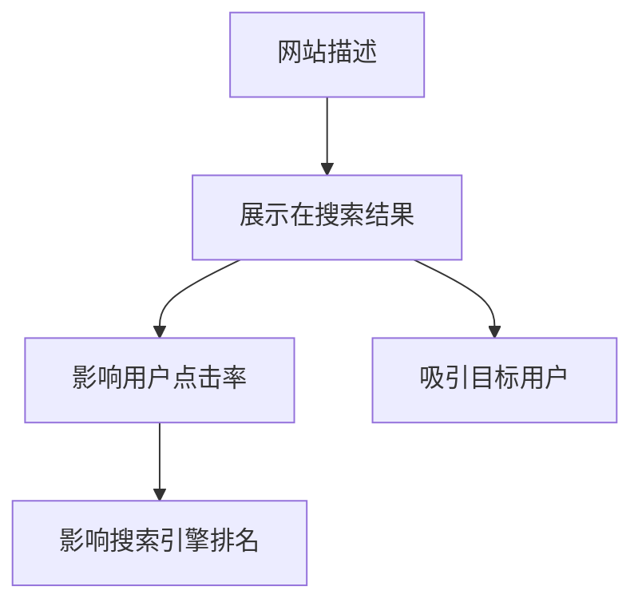
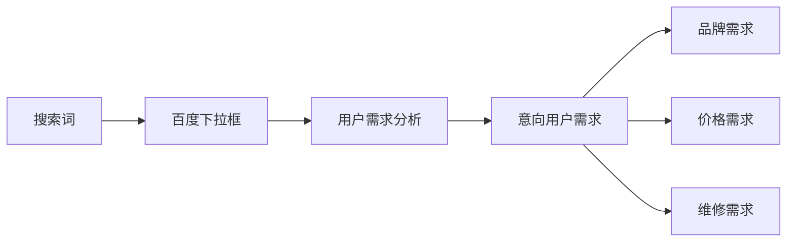

# 网站描述(Description)的书写规则

## 基本概念
网站描述是SEO中TDK(Title、Description、Keywords)的重要组成部分,它让我们用简短的语言描述网站内容,直接影响用户的点击率。

### 描述的作用


### 书写规范
1. 字数要求: 60-80个字之间
2. 标题字数: 32个字左右
3. 核心要素: 
   - 把握用户需求(痛点)
   - 突出行业优势
   - 包含关键词

### 用户需求分析方法


## 练习题

### 题目1: 分析用户需求
假设你正在运营一个在线教育网站,请分析用户可能的搜索意图,并列出3个主要的用户痛点。

### 题目2: 补全代码
以下是一个分析描述字数的JavaScript函数,请补全代码:

```javascript
function checkDescription(description) {
    // 补全代码: 判断描述的字数是否在60-80之间
    // 返回值: 字数符合要求返回true,否则返回false
    
}
```

### 题目3: 关键词提取
完成以下函数,从描述中提取关键词:

```javascript
function extractKeywords(description) {
    // 补全代码: 将描述按空格分割,提取3-5个长度大于2的词作为关键词
    // 返回值: 关键词数组
    
}
```

### 题目4: 描述优化
给定以下网站描述,请判断是否合格并给出优化建议:
"我们是一家专业的在线教育机构,提供优质的课程。"

<details>
<summary>参考答案</summary>

### 题目1答案:
可能的用户痛点:
1. 课程质量难以保证
2. 学习效果没有保障
3. 价格与服务不匹配

### 题目2答案:
```javascript
function checkDescription(description) {
    const length = description.length;
    return length >= 60 && length <= 80;
}
```

### 题目3答案:
```javascript
function extractKeywords(description) {
    return description.split(' ')
        .filter(word => word.length > 2)
        .slice(0, 5);
}
```

### 题目4答案:
原描述存在问题:
1. 字数不足(当前字数约20个字)
2. 没有突出核心优势
3. 缺少具体的用户价值点

优化建议:
"XX在线教育拥有10年专业教学经验,汇集500位资深讲师,课程涵盖IT、设计等热门领域,采用AI智能学习系统,确保学习效果,已助力超10万学员成功就业。"
</details>