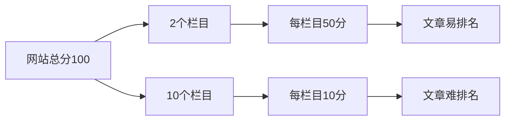
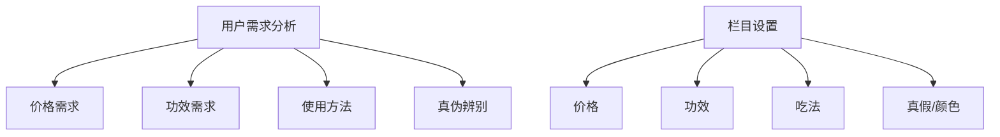

# 网站高阶栏目打造

## 栏目的重要性
栏目是网站重要的组成部分,主要用于引导用户点击。它直接影响用户体验和网站排名。

## 栏目设计的三大原则

### 1. 数量控制
- 一般不超过9个栏目
- 正常网站6个栏目即可
- 栏目数量与权重分配关系:



### 2. 符合用户需求
- 需要通过数据分析确定用户需求
- 可以通过搜索下拉框了解用户搜索趋势
- 栏目设置要对应用户最常见的需求点

### 3. 合理的顺序安排
- 重要栏目靠前
- 符合用户浏览习惯
- 产品信息优先于公司介绍

## 实例分析

### 黑枸杞网站栏目设计


## 练习题

### 题目1: 栏目权重计算
完成以下代码,计算每个栏目的权重分数:

```javascript
function calculateWeight(totalScore, columnCount) {
    // 补充代码:返回每个栏目的权重分数
}
```

### 题目2: 栏目排序优化
完成以下代码,将栏目按重要性排序:

```javascript
function sortColumns(columns) {
    // columns格式: [{name: '产品', importance: 5}, {name: '关于我们', importance: 1}]
    // 补充代码:返回排序后的栏目数组
}
```

### 题目3: 用户需求分析
完成以下代码,从搜索关键词中提取用户需求类型:

```javascript
function analyzeUserNeeds(searchKeywords) {
    // searchKeywords: ['价格多少', '功效怎么样', '怎么吃', '真假辨别']
    // 补充代码:返回需求类型统计对象 {price: 1, effect: 1, usage: 1, authenticity: 1}
}
```

<details>
<summary>参考答案</summary>

```javascript
// 题目1
function calculateWeight(totalScore, columnCount) {
    return totalScore / columnCount;
}

// 题目2
function sortColumns(columns) {
    return columns.sort((a, b) => b.importance - a.importance);
}

// 题目3
function analyzeUserNeeds(searchKeywords) {
    const needsMap = {
        price: 0,
        effect: 0,
        usage: 0,
        authenticity: 0
    };
    
    searchKeywords.forEach(keyword => {
        if(keyword.includes('价格') || keyword.includes('多少钱')) needsMap.price++;
        if(keyword.includes('功效') || keyword.includes('作用')) needsMap.effect++;
        if(keyword.includes('怎么吃') || keyword.includes('使用')) needsMap.usage++;
        if(keyword.includes('真假') || keyword.includes('辨别')) needsMap.authenticity++;
    });
    
    return needsMap;
}
```
</details>