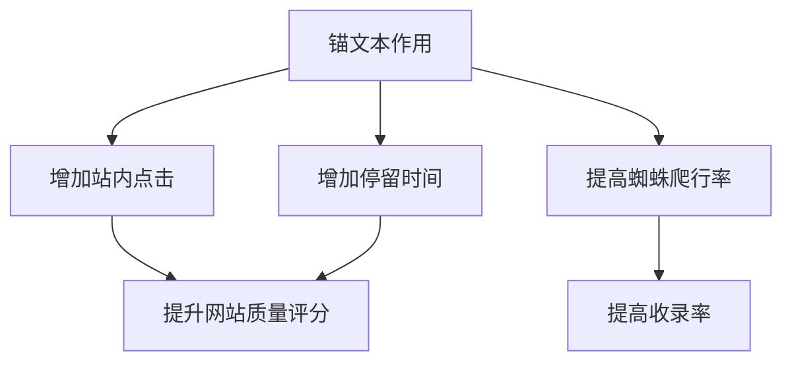
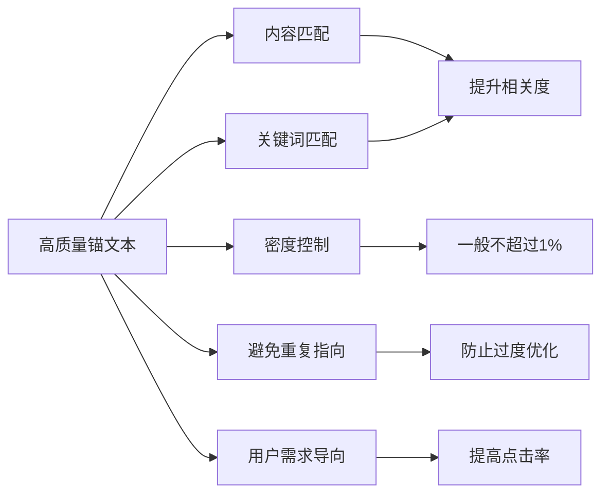

# 高质量锚文本优化指南

## 什么是锚文本?
锚文本是网页中可点击并跳转到其他页面的文字链接。它是一种重要的SEO优化手段。

## 锚文本的作用



## 高质量锚文本的5个关键点



## 实践要点
1. 内容匹配: 锚文本与目标页面内容高度相关
2. 关键词匹配: 与目标页面TDK设置相符
3. 密度控制: 建议500字2个,1000字4个
4. 避免重复: 不同锚文本不应指向同一页面
5. 用户导向: 从用户需求出发设置锚文本

## 练习题

### 题目1: 分析锚文本质量
给定一篇1000字的SEO文章,其中包含以下锚文本设置,请分析是否合理:
- "SEO优化" -> 指向SEO基础教程
- "关键词" -> 指向关键词布局指南  
- "外链建设" -> 指向外链优化教程
- "网站收录" -> 指向收录优化指南
- "TDK设置" -> 指向SEO基础教程

### 题目2: 代码实现
完成以下代码,实现一个检测锚文本密度是否合理的函数:

```javascript
function checkAnchorDensity(totalWords, anchorCount) {
    // 补充代码:计算锚文本密度并判断是否合理(不超过1%)
}
```

### 题目3: 实现锚文本相关性检测
补充下面的代码,实现一个简单的相关性检测函数:

```javascript
function checkAnchorRelevance(anchorText, targetPageTitle, targetPageKeywords) {
    // 补充代码:检查锚文本与目标页面的相关性
}
```

<details>
<summary>参考答案</summary>

### 题目1答案:
存在问题:
1. "SEO优化"和"TDK设置"指向同一页面,违反了避免重复原则
2. 5个锚文本/1000字 略微超出建议密度
3. 其他设置基本合理,主题相关性强

### 题目2答案:
```javascript
function checkAnchorDensity(totalWords, anchorCount) {
    const density = (anchorCount / totalWords) * 100;
    return {
        density: density,
        isReasonable: density <= 1
    };
}
```

### 题目3答案:
```javascript
function checkAnchorRelevance(anchorText, targetPageTitle, targetPageKeywords) {
    const anchorWords = anchorText.toLowerCase().split(' ');
    const titleWords = targetPageTitle.toLowerCase().split(' ');
    const keywordWords = targetPageKeywords.toLowerCase().split(',');
    
    const titleMatch = anchorWords.some(word => titleWords.includes(word));
    const keywordMatch = anchorWords.some(word => keywordWords.includes(word));
    
    return {
        isRelevant: titleMatch || keywordMatch,
        titleMatch: titleMatch,
        keywordMatch: keywordMatch
    };
}
```
</details>