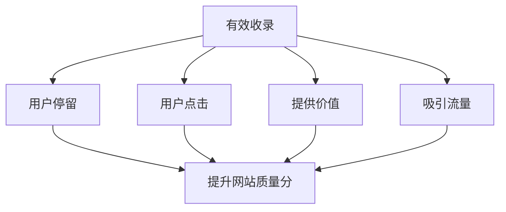

# 有效收录优化指南

## 什么是有效收录
有效收录是指发布的文章具备以下特征:
- 有用户停留和点击
- 用户愿意浏览内容
- 能为用户提供帮助
- 能吸引更多搜索引擎用户



## 文章质量要求

### 1. 图文结合
- 建议每篇文章配置约3张图片
- 提升用户视觉体验
- 避免纯文字导致用户快速流失

### 2. 字数要求
- 每篇文章至少800字
- 这是搜索引擎认可的基本门槛

### 3. 内容规划
- 基于关键词规划内容
- 挖掘长尾关键词
- 避免随意发布无目的内容

### 关于原创与伪原创
- 百度鼓励原创但有容忍度
- 核心是用户体验而非原创性
- 合理的伪原创也可以获得好的排名

## 练习题

### 1. 内容分析题
请补充完成以下函数,该函数用于判断一篇文章是否满足基本发布要求:

```javascript
function isValidArticle(article) {
  // 补充代码:检查文章字数是否>=800,图片数量是否>=3
}
```

### 2. 用户行为分析题
完成以下函数,计算文章的用户参与度得分:

```javascript
function calculateEngagementScore(timeOnPage, clickCount, bounceRate) {
  // 补充代码:根据停留时间(秒)、点击次数、跳出率(0-1)计算参与度得分(0-100)
}
```

### 3. SEO评分题
补充完成以下函数,评估一篇文章的SEO友好度:

```javascript
function calculateSEOScore({
  wordCount,
  imageCount,
  hasKeywords,
  readingTime
}) {
  // 补充代码:根据传入的指标计算SEO得分(0-100)
}
```

<details>
<summary>参考答案</summary>

// 题目1答案
```javascript
// 题目1答案
function isValidArticle(article) {
  if (!article || typeof article !== 'object') {
    return false;
  }
  
  const wordCount = article.wordCount || article.content?.length || 0;
  const imageCount = article.imageCount || 
                     (article.content?.match(/]*>/g) || []).length || 
                     0;
  
  return wordCount >= 800 && imageCount >= 3;
}

// ... existing code ...
```

```javascript
// 题目2答案
function calculateEngagementScore(timeOnPage, clickCount, bounceRate) {
  const timeScore = Math.min(timeOnPage / 120, 1) * 40; // 最高40分
  const clickScore = Math.min(clickCount / 5, 1) * 30;  // 最高30分
  const bounceScore = (1 - bounceRate) * 30;  // 最高30分
  return timeScore + clickScore + bounceScore;
}
```

```javascript
// 题目3答案
function calculateSEOScore({
  wordCount,
  imageCount,
  hasKeywords,
  readingTime
}) {
  const wordScore = Math.min(wordCount / 800, 1) * 40;
  const imageScore = Math.min(imageCount / 3, 1) * 20;
  const keywordScore = hasKeywords ? 20 : 0;
  const readingScore = Math.min(readingTime / 180, 1) * 20;
  return wordScore + imageScore + keywordScore + readingScore;
}
```
</details>