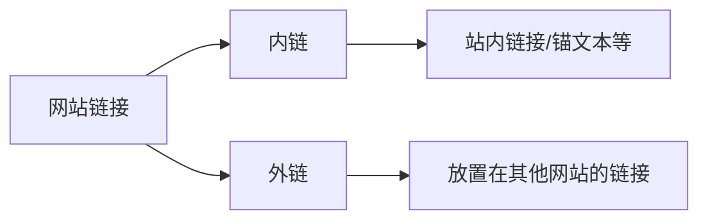
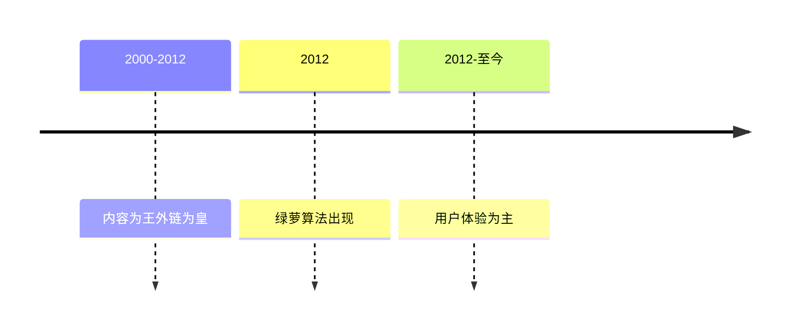

# SEO外链策略与算法

## 什么是外链
外链(External Link)是指将自己网站的链接放置在其他网站上的链接。与之相对的是内链(Internal Link),即网站内部的链接。



## 外链的主要作用

1. **吸引用户点击**
   - 增加网站流量
   - 提供用户数据给搜索引擎
   - 提高排名几率

2. **吸引搜索引擎蜘蛛**
   - 作为蜘蛛爬行通道
   - 增加文章收录几率

## 外链发展历史



## 绿萝算法
- 专门针对外链质量的检测算法
- 类似锚文本检测方法
- 重点关注外链的真实性和质量

## 实践建议
1. 新站前1-2个月重点发展外链
2. 后期维护每天1-2小时即可
3. 谨慎选择外链平台
4. 注意外链质量而非数量

## 练习题

### 题目1: 外链检测
完成以下函数,判断一个链接是否为外链:
```javascript
function isExternalLink(currentDomain, linkUrl) {
  // 补充代码:
  // 1. 将linkUrl转换为URL对象
  // 2. 比较linkUrl的域名是否与currentDomain相同
  // 3. 返回布尔值
}
```

### 题目2: 外链质量评分
完成以下函数的评分逻辑:
```javascript
function calculateLinkQuality(link) {
  let score = 0;
  // 补充代码:
  // 1. 检查link.domain是否为知名网站 (+2分)
  // 2. 检查link.age是否大于1年 (+1分)
  // 3. 检查link.traffic是否大于1000 (+1分)
}
```

### 题目3: 绿萝算法模拟
补充以下代码模拟简单的绿萝算法检测:
```javascript
function luoAlgorithmCheck(links) {
  // 补充代码:
  // 1. 统计同一域名下的外链数量
  // 2. 如果某个域名的外链数量超过总数的30%,返回false
  // 3. 否则返回true
}
```

<details>
<summary>参考答案</summary>

```javascript
// 题目1
function isExternalLink(currentDomain, linkUrl) {
  const url = new URL(linkUrl);
  return url.hostname !== currentDomain;
}

// 题目2
function calculateLinkQuality(link) {
  let score = 0;
  if(['github.com', 'stackoverflow.com'].includes(link.domain)) score += 2;
  if(link.age > 1) score += 1;
  if(link.traffic > 1000) score += 1;
  return score;
}

// 题目3
function luoAlgorithmCheck(links) {
  const domainCount = {};
  links.forEach(link => {
    domainCount[link.domain] = (domainCount[link.domain] || 0) + 1;
  });
  return !Object.values(domainCount).some(count => count > links.length * 0.3);
}
```
</details>