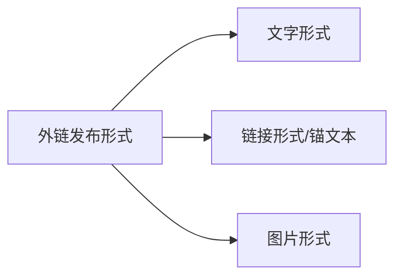
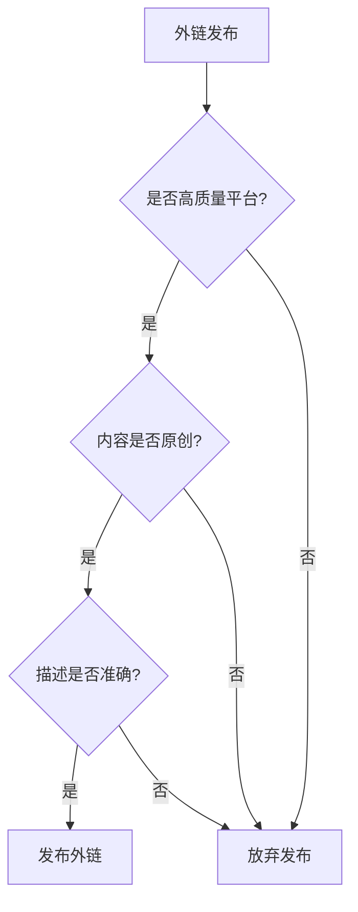

# 网站SEO外链发布技巧

## 外链发布形式
外链主要有三种发布形式:




## 外链发布注意事项

1. **选择高质量平台**
   - 避免使用低质量平台,因为链接容易被删除
   - 建议使用知名度高的平台(如知乎、简书等)

2. **内容描述准确**
   - 链接描述要与实际网站内容相符
   - 避免误导性描述增加跳出率

3. **内容原创性**
   - 不要在多个平台发布相同内容
   - 避免触发百度绿萝算法




## 练习题

1. 实现一个函数检查外链描述与网站内容的相关性:

```javascript
function checkRelevance(description, websiteContent) {
    // 补充代码:
    // 1. 将description和websiteContent转换为小写
    // 2. 检查description中的关键词是否出现在websiteContent中
    // 3. 返回相关性得分(0-1之间)
}
```


2. 实现一个函数检测内容是否重复:

```javascript
function checkDuplicate(content, existingContents) {
    // 补充代码:
    // 1. 计算content与existingContents中每个内容的相似度
    // 2. 如果相似度超过80%则返回true表示重复
}
```


3. 实现一个函数生成合适的锚文本:

```javascript
function generateAnchorText(websiteType, keywords) {
    // 补充代码:
    // 根据网站类型和关键词生成自然的锚文本
}
```


<details>
<summary>参考答案</summary>

```javascript
// 题目1答案
function checkRelevance(description, websiteContent) {
    description = description.toLowerCase();
    websiteContent = websiteContent.toLowerCase();
    const keywords = description.split(' ');
    let matches = 0;
    keywords.forEach(keyword => {
        if(websiteContent.includes(keyword)) matches++;
    });
    return matches / keywords.length;
}

// 题目2答案
function checkDuplicate(content, existingContents) {
    return existingContents.some(existing => {
        const similarity = levenshteinDistance(content, existing) / Math.max(content.length, existing.length);
        return similarity > 0.8;
    });
}

// 题目3答案
function generateAnchorText(websiteType, keywords) {
    const templates = {
        'movie': '推荐一个很棒的电影网站',
        'blog': '分享一个优质博客',
        'shop': '值得信赖的购物平台'
    };
    return `${templates[websiteType]} - ${keywords.join(',')}`;
}
```

</details>