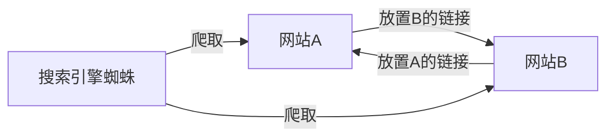
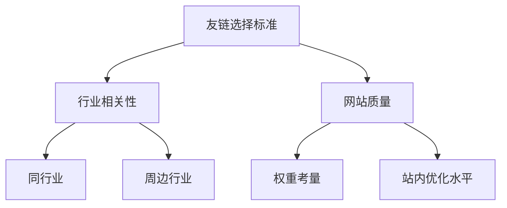

# 友情链接及其SEO优化策略

## 什么是友情链接?
友情链接(Friend Links)是一种双向的外部链接交换机制。两个网站互相在各自平台上放置对方的链接,形成互惠互利的关系。



## 友情链接的作用
1. 增加蜘蛛爬取频率
2. 提升网站收录率
3. 带动网站权重
4. 帮助新站快速度过新手期

## 友情链接交换规则

### 1. 数量控制
- 建议维持在30个左右
- 过少: 价值发挥不充分
- 过多: 蜘蛛资源被过度分散

### 2. 选择标准


### 3. 技术注意事项
- 避免使用nofollow属性(阻止蜘蛛爬行)
- 首页vs内页放置考量
  - 首页蜘蛛量较大
  - 传递价值更高

## 练习题

### 1. 代码实现题: 友链权重计算
补充下面代码中的计算逻辑:

```javascript
function calculateLinkValue(pageType, siteWeight, hasNofollow) {
    let baseValue = 100;
    // 补充代码: 
    // 1. 如果是首页,baseValue翻倍
    // 2. 根据站点权重(1-10)每级增加10%的baseValue
    // 3. 如果有nofollow属性,value变为0
    
    return value;
}
```

### 2. 实践题: 友链优化方案
给定以下场景,请选择最优的友链交换方案:
- 你的网站: 新站,权重1
- 可选择的交换对象:
  A. 权重8的网站内页
  B. 权重2的网站首页
  C. 权重4的网站首页(但带nofollow)
  D. 权重3的同行业网站首页

### 3. 代码实现题: 友链分析
补充下面的代码逻辑:

```javascript
function analyzeFriendLinks(links) {
    // links是友链数组,每个元素包含 {url, pageType, weight, hasNofollow}
    // 补充代码:
    // 1. 统计首页友链比例
    // 2. 计算所有友链的平均权重
    // 3. 返回一个对象包含这两个统计结果
    
    return result;
}
```

<details>
<summary>参考答案</summary>

### 题目1答案:
```javascript
function calculateLinkValue(pageType, siteWeight, hasNofollow) {
    let baseValue = 100;
    if (pageType === 'homepage') baseValue *= 2;
    baseValue *= (1 + (siteWeight - 1) * 0.1);
    return hasNofollow ? 0 : baseValue;
}
```

### 题目2答案:
最优选择是 D. 权重3的同行业网站首页
原因:
1. 没有nofollow限制
2. 是首页交换
3. 行业相关性高
4. 权重差距适中,更容易被接受

### 题目3答案:
```javascript
function analyzeFriendLinks(links) {
    const homepageLinks = links.filter(link => link.pageType === 'homepage');
    const homepageRatio = homepageLinks.length / links.length;
    const avgWeight = links.reduce((sum, link) => sum + link.weight, 0) / links.length;
    
    return {
        homepageRatio,
        averageWeight: avgWeight
    };
}
```
</details>