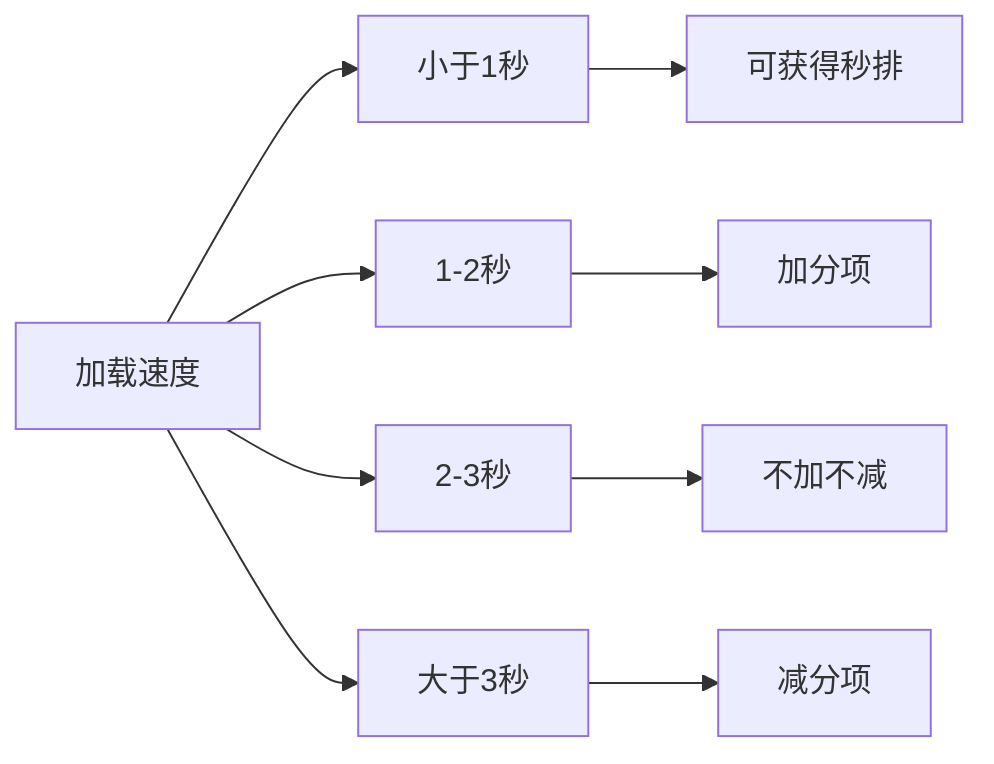

# 闪电算法与秒排数据要求

## 基本概念

### 闪电算法
闪电算法是百度针对网站打开速度提出的一项优化规则,主要从用户体验角度考虑。

### 加载速度要求



## 影响网站加载速度的三大因素

1. **模板选择**
   - CSS和JS文件要精简
   - 代码结构要清晰,便于蜘蛛爬取

2. **文件大小**
   - 特别是图片文件的优化
   - 避免大文件拖累整站加载速度

3. **服务器选择**
   - 需要考虑各地区访问速度
   - 服务器稳定性要好

## 优化检测方法

1. **源代码检查法**
   - 使用浏览器开发者工具
   - 检查Network面板下各文件加载时间

2. **站长工具检测法**
   - 使用站长工具的网站测速功能
   - 检测全国各地的访问速度

## 练习题

### 题目1: 图片优化
补全以下代码,实现一个简单的图片大小检测函数:

```javascript
function checkImageSize(imageUrl) {
    return new Promise((resolve, reject) => {
        const img = new Image();
        // 补充代码: 设置图片加载完成的回调
        img.onload = function() {
            // 补充代码: 获取图片文件大小(假设限制为500KB)
            fetch(imageUrl).then(response => {
                const size = response.headers.get('content-length');
                resolve(size < 500 * 1024);
            });
        }
        // 补充代码: 设置图片src
        img.src = imageUrl;
    });
}
```

### 题目2: 页面加载时间检测
实现一个函数来检测页面加载时间是否符合闪电算法要求:

```javascript
function checkPageLoadTime() {
    // 补充代码: 获取页面加载开始时间
    const startTime = performance.now();
    
    window.onload = function() {
        // 补充代码: 计算加载时间
        const loadTime = (performance.now() - startTime) / 1000;
        
        // 补充代码: 根据闪电算法判断加载时间等级
        if(loadTime < 1) return "秒排";
        if(loadTime < 2) return "加分";
        if(loadTime < 3) return "正常";
        return "减分";
    }
}
```

### 题目3: 资源加载检测
补全代码,实现检测页面所有资源的加载时间:

```javascript
function checkResourcesLoadTime() {
    // 补充代码: 使用Performance API获取所有资源
    const resources = performance.getEntriesByType('resource');
    
    // 补充代码: 过滤出加载时间超过3秒的资源
    const slowResources = resources.filter(item => item.duration > 3000);
    
    // 补充代码: 返回需要优化的资源列表
    return slowResources.map(item => ({
        name: item.name,
        duration: item.duration
    }));
}
```

<details>
<summary>参考答案</summary>

题目1:
```javascript
img.onload = function() {
    fetch(imageUrl).then(response => {
        const size = response.headers.get('content-length');
        resolve(size < 500 * 1024);
    });
}
img.src = imageUrl;
```

题目2:
```javascript
const startTime = performance.now();
const loadTime = (performance.now() - startTime) / 1000;
if(loadTime < 1) return "秒排";
```

题目3:
```javascript
const resources = performance.getEntriesByType('resource');
const slowResources = resources.filter(item => item.duration > 3000);
return slowResources.map(item => ({
    name: item.name,
    duration: item.duration
}));
```
</details>