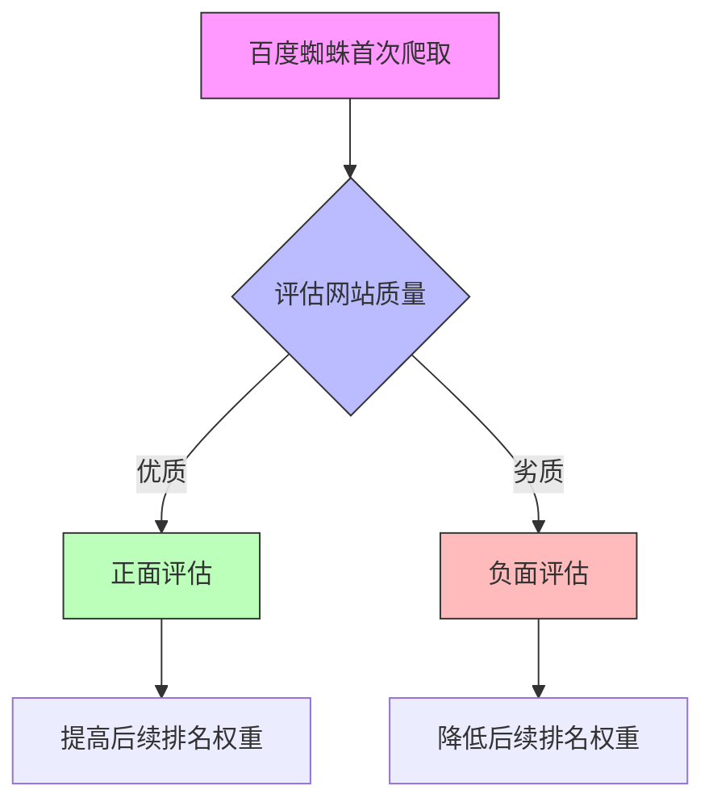

# SEO第一印象规则

## 基本概念

第一印象规则是百度蜘蛛首次爬取网站时的评估机制。这个规则会影响网站后续的排名表现。




## 重要性

1. 决定网站未来排名走向
2. 影响百度对网站的信任度
3. 影响后续内容的评估标准

## 优化建议


## 常见错误

1. 未经优化就上线网站
2. 频繁修改核心要素(如TDK)
3. 分散式优化而非一次性优化

## 练习题

### 1. 网站优化顺序题
请将以下优化步骤按正确顺序排列:
A. 网站上线
B. SEO规则学习
C. 域名购买
D. 整体优化
E. 服务器选择

### 2. JavaScript实现SEO检测工具
完成以下代码,实现一个简单的TDK检测函数:

```javascript
function checkTDK(title, description, keywords) {
    const result = {
        titleValid: false,
        descriptionValid: false,
        keywordsValid: false
    };
    
    // 补充代码：检查title长度是否在10-60个字符之间
    
    // 补充代码：检查description长度是否在50-160个字符之间
    
    // 补充代码：检查keywords是否包含3-5个关键词
    
    return result;
}
```

### 3. 实现域名评估函数
完成以下代码,实现一个简单的域名评估函数:

```javascript
function evaluateDomain(domainName) {
    // 补充代码：检查域名长度是否合适(建议5-15个字符)
    
    // 补充代码：检查是否包含连字符(不建议)
    
    // 补充代码：检查是否全为字母或数字
}
```

<details>
<summary>参考答案</summary>

### 题目1答案:
正确顺序: B -> C -> E -> D -> A

### 题目2答案:
```javascript
function checkTDK(title, description, keywords) {
    const result = {
        titleValid: false,
        descriptionValid: false,
        keywordsValid: false
    };
    
    result.titleValid = title.length >= 10 && title.length <= 60;
    
    result.descriptionValid = description.length >= 50 && description.length <= 160;
    
    result.keywordsValid = keywords.split(',').length >= 3 && keywords.split(',').length <= 5;
    
    return result;
}
```

### 题目3答案:
```javascript
function evaluateDomain(domainName) {
    const length = domainName.length >= 5 && domainName.length <= 15;
    
    const hasHyphen = domainName.includes('-');
    
    const isAlphaNumeric = /^[a-zA-Z0-9]+$/.test(domainName);
    
    return {
        isValid: length && !hasHyphen && isAlphaNumeric,
        issues: {
            length,
            hasHyphen,
            isAlphaNumeric
        }
    };
}
```
</details>