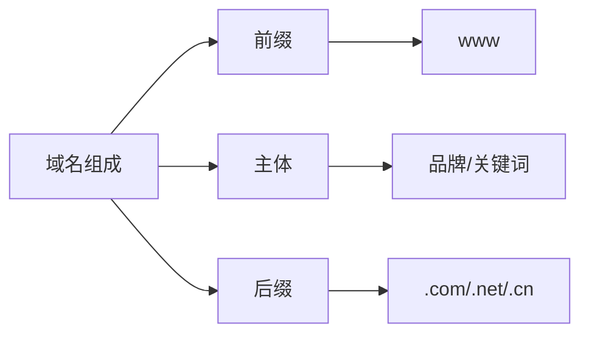

# 选择符合SEO的网站域名

## 域名的基本组成
域名由三个主要部分组成:



### 前缀
- 通常使用 www
- 这是解析自动生成的,不需要特别关注

### 主体
- 网站的核心部分
- 可以选择:
  - 产品关键词
  - 产品拼音(全拼或缩写)
  - 英文名称
  - 品牌名称

### 后缀
推荐使用以下常见后缀:
- .com
- .net
- .cn

## 域名选择的SEO考虑因素
1. 用户记忆度
2. 品牌相关性
3. 关键词匹配度
4. 搜索引擎友好度

## 练习题

### 1. 域名组成分析
给定域名 "www.xiaomi.com", 请分析其组成部分。

### 2. 编程实战
完成以下函数,将公司名称转换为域名缩写(仅保留拼音首字母):

```javascript
function getCompanyDomainAbbr(companyName) {
    // 补充代码:
    // 1. 将中文公司名按空格分割
    // 2. 获取每个词的拼音首字母
    // 3. 拼接成域名
}

// 测试用例
console.log(getCompanyDomainAbbr("长沙 建材 公司")); // 应输出: "csjcgs"
```

### 3. 实战分析
分析以下域名的SEO友好度,并给出评分(1-5分):
- jd.com
- taobao.com
- tmall.com

<details>
<summary>参考答案</summary>

### 1. 域名组成分析答案
- 前缀: www
- 主体: xiaomi
- 后缀: .com

### 2. 编程实战答案
```javascript
function getCompanyDomainAbbr(companyName) {
    const pinyin = require('pinyin');
    return companyName
        .split(' ')
        .map(word => pinyin(word, {style: pinyin.STYLE_FIRST_LETTER})[0][0])
        .join('');
}
```

### 3. 实战分析答案
- jd.com: 4分
  - 优点: 简短,好记
  - 缺点: 缩写可能影响新用户理解
- taobao.com: 5分
  - 优点: 品牌名完整,易记忆,包含核心关键词
- tmall.com: 3分
  - 优点: 简短
  - 缺点: 不含完整关键词,新用户可能不理解含义

</details>