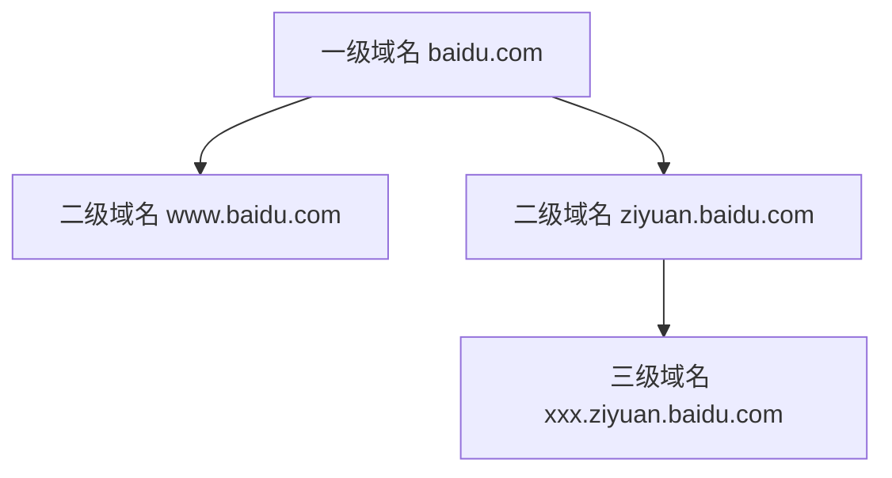

# 域名层级与SEO优化

## 域名层级定义

### 一级域名
- 注册购买时的主域名
- 例如: `baidu.com`
- 拥有最高权重

### 二级域名
- 在一级域名前添加前缀
- 例如: `www.baidu.com`, `ziyuan.baidu.com`

### 三级及以上域名
- 在二级域名基础上继续添加前缀
- 例如: `something.ziyuan.baidu.com`



## 网站链接层级与SEO

### 排名难度递增顺序
1. 主域名(最容易排名)
2. 二级域名
3. 栏目页
4. 内页(最难排名)


## 注意事项
1. 链接越长越难排名
2. 避免使用他人的二级域名建站
3. 网站权重会向一级域名集中
4. 建议自主注册域名和搭建网站

## 练习题

### 1. 域名层级判断
给定以下域名,判断它们的层级:
- blog.company.com
- www.test.company.com
- company.com
- a.b.c.company.com

### 2. 代码实现: 域名层级计算器
补全下面的JavaScript代码,实现计算域名层级的功能:

```javascript
function getDomainLevel(domain) {
    // 补全代码:
    // 1. 将域名按点分割
    // 2. 计算层级(注意减去顶级域名部分)
}
```

### 3. SEO友好度评分
补全下面的JavaScript代码,实现一个简单的URL SEO友好度评分(0-100分):

```javascript
function getSeoScore(url) {
    // 补全代码:
    // 1. 计算URL长度(越短越好)
    // 2. 检查是否为主域名
    // 3. 根据层级深度评分
}
```

<details>
<summary>参考答案</summary>

### 1. 域名层级判断
- blog.company.com: 二级域名
- www.test.company.com: 三级域名
- company.com: 一级域名
- a.b.c.company.com: 四级域名

### 2. 域名层级计算器
```javascript
function getDomainLevel(domain) {
    const parts = domain.split('.');
    // 减去顶级域名部分(如.com)
    return parts.length - 1;
}
```

### 3. SEO友好度评分
```javascript
function getSeoScore(url) {
    const urlObj = new URL(url);
    const domainParts = urlObj.hostname.split('.');
    const pathDepth = urlObj.pathname.split('/').filter(Boolean).length;
    
    let score = 100;
    // URL长度扣分
    score -= Math.floor(url.length / 10);
    // 域名层级扣分
    score -= (domainParts.length - 2) * 10;
    // 路径深度扣分
    score -= pathDepth * 5;
    
    return Math.max(0, score);
}
```

示例使用:
```javascript
console.log(getSeoScore('https://www.example.com')); // 较高分
console.log(getSeoScore('https://blog.sub.example.com/category/post/1')); // 较低分
```
</details>