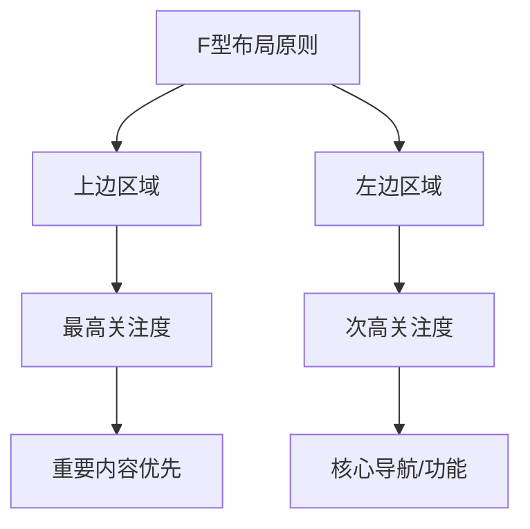

# 网站布局优化 - F型布局原则

## 什么是F型布局?

F型布局是基于用户浏览习惯的一种网页设计模式。热力图研究表明,用户的注意力和点击行为呈F型分布。更多布局模式可参考[12种经典网页布局设计](https://www.shejidaren.com/12-web-layout.html)。



## 布局要点

1. **重要内容位置**
   - 核心内容靠近左上角
   - 导航栏放置在顶部或左侧
   - 避免重要信息放在右侧

2. **栏目排序原则**
   - 重要栏目靠左
   - 次要信息(如"关于我们"、"联系方式")放右侧
   - 按用户需求优先级排序

3. **实际案例分析**
   - B站布局:
     - 顶部导航栏
     - 热门内容/轮播图
     - 直播间(互动区)
     - 按热度递减排列内容
   
   - 企业站布局:
     - 产品功效(左上角)
     - 使用方法
     - 价格信息
     - 其他辅助信息

## 练习题

### 题目1: 热区分析
给定一个网页点击热力数据数组,判断是否符合F型布局特征
```javascript
function isValidFLayout(heatmap) {
    // 补充代码:
    // 检查左上角区域(0,0)的点击值是否最高
    // 检查上边缘和左边缘的值是否普遍高于右下区域
}
```

### 题目2: 导航排序
实现一个函数,根据重要性对导航项进行排序
```javascript
function sortNavItems(items) {
    // 补充代码:
    // 根据item.importance对导航项进行排序
    // 返回排序后的数组
}
```

### 题目3: 布局评分
计算一个页面布局的F型布局评分(0-100)
```javascript
function calculateFScore(layout) {
    // 补充代码:
    // 检查重要元素的位置是否符合F型布局
    // 返回0-100的评分
}
```

<details>
<summary>参考答案</summary>

```javascript
// 题目1
function isValidFLayout(heatmap) {
    const topLeft = heatmap_0_0;
    const isTopHighest = heatmap_0.every(val => val <= topLeft);
    const isLeftHigher = heatmap.every(row => 
        row.slice(1).every(val => val <= row_0)
    );
    return isTopHighest && isLeftHigher;
}

// 题目2
function sortNavItems(items) {
    return items.sort((a, b) => b.importance - a.importance);
}

// 题目3
function calculateFScore(layout) {
    let score = 0;
    // 检查重要元素位置
    if (layout.mainContent.x < layout.width / 2 && 
        layout.mainContent.y < layout.height / 3) {
        score += 40;
    }
    // 检查导航栏位置
    if (layout.nav.position === 'top' || layout.nav.position === 'left') {
        score += 30;
    }
    // 检查次要内容位置
    if (layout.secondaryContent.x > layout.width / 2) {
        score += 30;
    }
    return score;
}
```
</details>