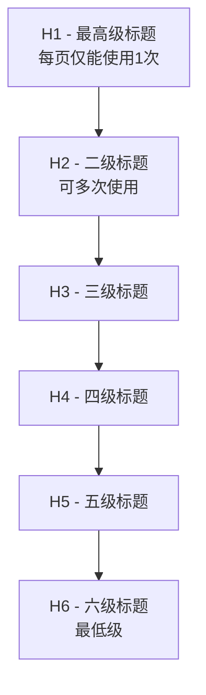

# H标签优化详解

## 什么是H标签?
H标签是HTML中的标题(Heading)标签,用于定义网页的标题层级结构。搜索引擎蜘蛛会特别重视H标签中的内容,将其视为页面重要内容的指标。

## H标签层级结构


## H标签使用要点
1. H1标签每个页面只能使用一次
2. H1通常用于放置主要关键词或页面主标题
3. H标签层级应当按顺序使用,权重递减
4. 建议给H1标签内容适当加粗,增加重要性
5. H2-H6可以多次使用,用于标识小段落重点

## 练习题

### 1. HTML结构补全
补全以下HTML代码,使其符合H标签的最佳实践:
```html
<div class="article">
  <!-- 补充代码:添加一个关于"SEO优化指南"的主标题 -->
  <div class="section">
    <h2>关键词布局</h2>
    <p>关键词布局的基本原则...</p>
  </div>
  <div class="section">
    <h2>内容优化</h2>
    <p>内容优化需要注意...</p>
  </div>
</div>
```

### 2. JavaScript DOM操作
完成以下JavaScript函数,检查页面是否符合H1标签使用规范:
```javascript
function checkH1Usage() {
  // 补充代码:获取页面所有H1标签并检查数量是否大于1
  // 如果大于1返回false,否则返回true
}
```

### 3. JavaScript实现标题提取
完成以下函数,将页面中的H标签内容按层级提取成对象:
```javascript
function extractHeadings() {
  // 补充代码:提取页面中所有H1-H6标签内容
  // 返回格式: {h1: [], h2: [], h3: [], h4: [], h5: [], h6: []}
}
```

<details>
<summary>参考答案</summary>

1. HTML结构补全:
```html
<div class="article">
  <h1>SEO优化指南</h1>
  <div class="section">
    <h2>关键词布局</h2>
    <p>关键词布局的基本原则...</p>
  </div>
  <div class="section">
    <h2>内容优化</h2>
    <p>内容优化需要注意...</p>
  </div>
</div>
```

2. JavaScript DOM操作:
```javascript
function checkH1Usage() {
  const h1Elements = document.getElementsByTagName('h1');
  return h1Elements.length <= 1;
}
```

3. JavaScript实现标题提取:
```javascript
function extractHeadings() {
  const result = {h1: [], h2: [], h3: [], h4: [], h5: [], h6: []};
  for(let i = 1; i <= 6; i++) {
    const elements = document.getElementsByTagName(`h${i}`);
    result[`h${i}`] = Array.from(elements).map(el => el.textContent);
  }
  return result;
}
```

</details>