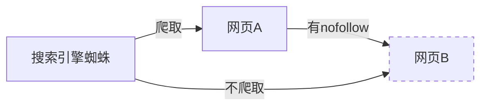

# nofollow 技术详解

## 基本定义
nofollow是一个HTML属性,用于告诉搜索引擎不要追踪(爬取)某个链接或者不要给这个链接分配权重分数。

## 工作原理



## 语法格式
```html
<a href="链接地址" rel="nofollow">链接文本</a>
```

## 常见应用场景
1. 外部链接
2. 客服链接(如QQ)
3. 广告链接
4. 不需要SEO的内部页面(如:关于我们、联系我们)

## 使用目的
1. 防止权重流失
2. 集中权重在重要页面
3. 防止垃圾链接影响网站排名

## 练习题

### 题目1: 基础语法
补充下面的代码,为外部链接添加nofollow属性:
```html
<a href="https://external-site.com" ___________>外部网站</a>
```

### 题目2: JS检测
完成以下JavaScript函数,检查一个链接是否包含nofollow属性:
```javascript
function hasNofollow(linkElement) {
    // 补充代码检查linkElement是否包含nofollow属性
    ____________
}
```

### 题目3: JS自动添加
完成以下函数,为所有外部链接添加nofollow属性:
```javascript
function addNofollowToExternalLinks() {
    const links = document.querySelectorAll('a');
    links.forEach(link => {
        // 补充代码判断是否为外部链接并添加nofollow
        if (_____________) {
            ____________
        }
    });
}
```

<details>
<summary>参考答案</summary>

题目1:
```html
<a href="https://external-site.com" rel="nofollow">外部网站</a>
```

题目2:
```javascript
function hasNofollow(linkElement) {
    return linkElement.rel && linkElement.rel.includes('nofollow');
}
```

题目3:
```javascript
function addNofollowToExternalLinks() {
    const links = document.querySelectorAll('a');
    const currentDomain = window.location.hostname;
    
    links.forEach(link => {
        if (link.hostname && link.hostname !== currentDomain) {
            link.rel = link.rel ? `${link.rel} nofollow` : 'nofollow';
        }
    });
}
```
</details>