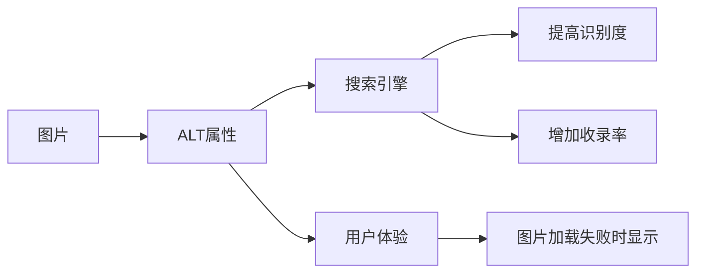
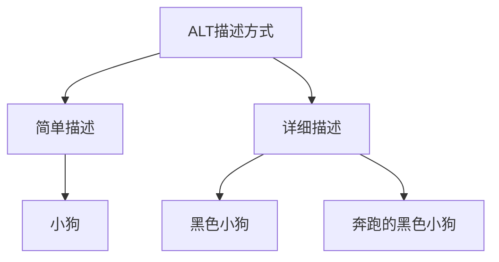

# 网站图片ALT优化

## 什么是ALT属性
ALT(Alternative Text)是HTML图片标签的一个属性,用于为图片提供文字说明。当图片无法显示时会显示这段文字,同时也帮助搜索引擎理解图片内容。




## ALT属性的重要性
1. 提升搜索引擎对图片的识别能力
2. 增加网页的收录概率
3. 提高网站在搜索结果中的排名
4. 改善用户体验

## ALT属性优化规范
1. 每张图片都要添加ALT属性
2. 描述要准确反映图片内容
3. 避免重复使用相同的ALT描述
4. 可以适当包含关键词,但要自然




## 练习题

### 题目1: 代码补全
补充下面代码中的ALT属性,使其符合SEO优化规范:
```javascript
function generateProductImage(product) {
    return ``
}
```


### 题目2: 代码补全
实现一个函数,检查页面所有图片是否都包含ALT属性:
```javascript
function checkImagesAlt() {
    const images = document.querySelectorAll('img');
    // 补充代码
}
```


### 题目3: 代码补全
实现一个函数,根据图片的上下文自动生成ALT描述:
```javascript
function generateAltDescription(imageContext) {
    // 补充代码,根据imageContext对象包含的图片信息生成合适的ALT描述
}
```


<details>
<summary>参考答案</summary>

题目1:
```javascript
function generateProductImage(product) {
    return ``
}
```


题目2:
```javascript
function checkImagesAlt() {
    const images = document.querySelectorAll('img');
    return Array.from(images).every(img => img.hasAttribute('alt') && img.alt.trim() !== '');
}
```


题目3:
```javascript
function generateAltDescription(imageContext) {
    const {category, mainSubject, action, color} = imageContext;
    return `${action ? action + ' ' : ''}${color ? color + ' ' : ''}${mainSubject} ${category}`.trim();
}
```


使用示例:
```javascript
const context = {
    category: '宠物',
    mainSubject: '小狗',
    action: '奔跑的',
    color: '黑色'
};
console.log(generateAltDescription(context)); // 输出: "奔跑的 黑色 小狗 宠物"
```

</details>