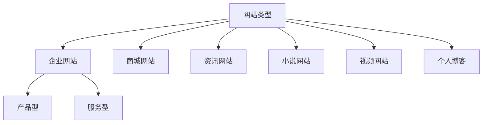
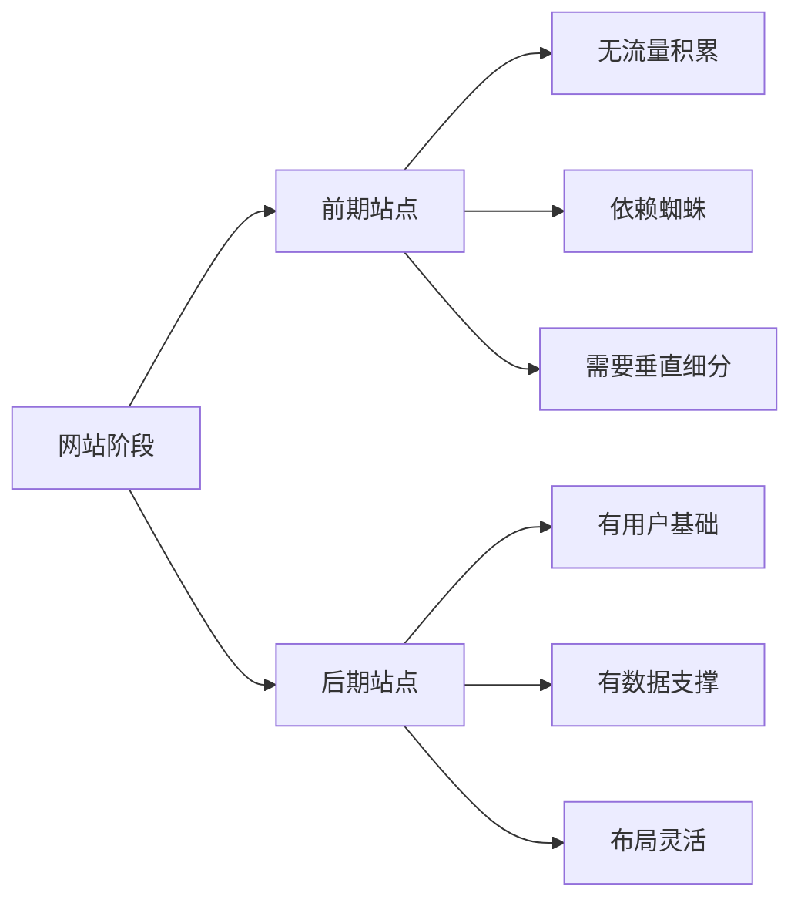

# 企业及其他类型网站SEO优化方案

## 网站类型分类




## 企业网站优化要点

### 产品型网站
1. 产品分类清晰
2. 热门产品单独栏目
3. 价格需求展示
4. 维修服务资讯
5. 公司保障信息

### 服务型网站
1. 服务流程说明
2. 服务区域划分
3. 价格标准
4. 客户案例展示

## 网站发展阶段




## 其他类型网站特点

### 商城网站
- 图片数量多
- 种类繁多
- 注重转化率

### 资讯网站
- 根据内容细分
- 用户需求分析
- 垂直度要求

### 小说/视频网站
- 内容固定
- 重视排行榜
- 差异化介绍

## 练习题

### 1. 数据分析实现
补全下面代码,实现一个简单的用户搜索关键词分析函数:

```javascript
function analyzeSearchKeywords(keywords) {
    let analysis = {};
    // 补全代码:统计每个关键词出现的次数
    
    return analysis;
}

// 测试用例
console.log(analyzeSearchKeywords(['价格', '服务', '价格', '质量', '服务']));
// 期望输出: { '价格': 2, '服务': 2, '质量': 1 }
```


### 2. 产品分类实现
补全代码,实现产品分类的数据结构:

```javascript
function createProductCategory() {
    // 补全代码:创建包含id、name、products数组的分类对象
    
}

// 测试用例
const category = createProductCategory();
category.addProduct({id: 1, name: '产品A'});
console.log(category.products); // [{id: 1, name: '产品A'}]
```


### 3. SEO友好的URL生成
实现一个函数,将中文标题转换为SEO友好的URL:

```javascript
function generateSeoUrl(title) {
    // 补全代码:将中文标题转换为拼音,并用横线连接
    
}

// 测试用例
console.log(generateSeoUrl('企业网站优化')); 
// 期望输出: 'qi-ye-wang-zhan-you-hua'
```


<details>
<summary>参考答案</summary>

```javascript
// 1. 数据分析实现
function analyzeSearchKeywords(keywords) {
    let analysis = {};
    keywords.forEach(keyword => {
        analysis[keyword] = (analysis[keyword] || 0) + 1;
    });
    return analysis;
}

// 2. 产品分类实现
function createProductCategory() {
    return {
        id: Date.now(),
        name: '',
        products: [],
        addProduct(product) {
            this.products.push(product);
        }
    };
}

// 3. SEO友好的URL生成
function generateSeoUrl(title) {
    // 注意:这里假设已经引入了pinyin库
    return pinyin(title, {
        style: pinyin.STYLE_NORMAL,
        separator: '-'
    }).join('-');
}
```

</details>