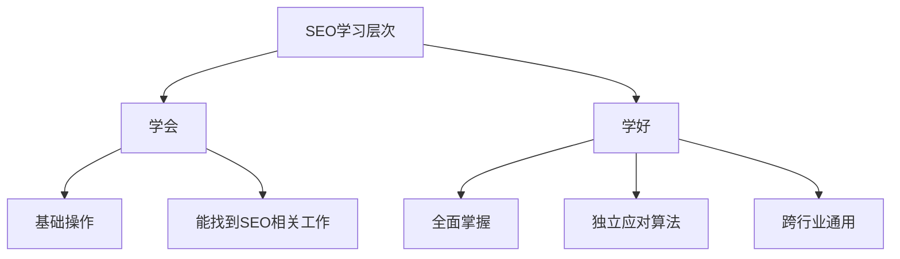

# 如何学好SEO

## 学会vs学好的区别



### 学会的特点
- 掌握基础操作
- 能胜任SEO专员工作
- 工资在3000-5000左右

### 学好的特点
- 全面掌握SEO知识体系
- 能独立应对百度算法调整
- 跨行业通用性强
- 工资可达万元以上

## 快速学习方法

### 1. 避免闭门造车
- 加入合适的学习群体
- 与优秀的同行交流
- 保持开放学习的心态

### 2. 向专家学习
- 善于请教前辈
- 避免走弯路
- 高效利用时间

### 3. 培养SEO思维
- 学会换位思考
- 经常运用SEO思维
- 关注算法变化

## 练习题

### 1. SEO思维训练
请补充完成以下代码,实现一个检查网页标题是否符合SEO优化要求的函数:

```javascript
function checkSEOTitle(title) {
    // 补充代码：检查标题长度是否在10-60字符之间
    // 补充代码：检查是否包含关键词
    // 补充代码：返回布尔值表示是否合格
}
```

### 2. 算法应对能力
完成以下代码,模拟网站在遇到算法更新时的处理逻辑:

```javascript
function handleAlgorithmUpdate(website) {
    // 补充代码：检查网站内容质量
    // 补充代码：更新网站结构
    // 补充代码：返回优化建议数组
}
```

### 3. 跨行业分析
实现一个函数,分析不同行业网站的SEO特点:

```javascript
function analyzeIndustrySEO(industry, website) {
    // 补充代码：根据行业特点分析关键词
    // 补充代码：分析竞争对手
    // 补充代码：返回分析报告对象
}
```

<details>
<summary>参考答案</summary>

```javascript
// 题目1答案
function checkSEOTitle(title) {
    const length = title.length;
    const hasKeyword = /关键词/.test(title);
    return length >= 10 && length <= 60 && hasKeyword;
}

/// 题目2: 算法应对能力
function handleAlgorithmUpdate(website) {
    const suggestions = [];
    
    // 检查网站内容质量
    if (!website.hasOriginalContent) {
        suggestions.push('增加原创内容');
    }
    if (website.contentLength < 1000) {
        suggestions.push('增加内容长度');
    }
    
    // 检查网站结构
    if (!website.hasSitemap) {
        suggestions.push('添加网站地图');
    }
    if (!website.hasSSL) {
        suggestions.push('添加SSL证书');
    }
    if (!website.isMobileFriendly) {
        suggestions.push('优化移动端适配');
    }
    
    return suggestions;
}

// 题目3: 跨行业分析
function analyzeIndustrySEO(industry, website) {
    // 分析行业关键词
    const keywords = {
        mainKeywords: getIndustryMainKeywords(industry),
        longTailKeywords: getIndustryLongTailKeywords(industry),
        localKeywords: getLocalKeywords(industry, website.location)
    };
    
    // 分析竞争对手
    const competitors = {
        directCompetitors: findTopCompetitors(industry, 5),
        keywordGaps: analyzeKeywordGaps(website, keywords),
        backlinksAnalysis: analyzeCompetitorBacklinks()
    };
    
    // 返回分析报告
    return {
        industryAnalysis: {
            marketSize: getMarketSize(industry),
            searchVolume: getSearchVolume(keywords),
            competitionLevel: calculateCompetitionLevel(competitors)
        },
        keywords: keywords,
        competitors: competitors,
        recommendations: generateOptimizationPlan(keywords, competitors)
    };
}
```
</details>