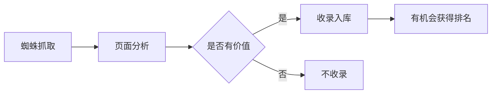

# 什么是收录

## 基本概念

收录是搜索引擎将网页存储在其数据库中的过程。这是网页获得搜索排名的必要条件。




## 收录类型

1. 有效收录 - 对网站有价值的收录
2. 无效收录 - 可能会被降权的收录

## 如何查看页面是否被收录

1. 直接搜索方式:
   - 在百度搜索框输入网址
   - 如果能搜到说明已收录
   - 如果搜不到则未收录

2. 主动提交方式:
   - 访问 ziyuan.baidu.com
   - 使用链接提交功能
   - 支持主动推送和被动推送

## 练习题

1. 判断题: 以下说法是否正确?

```
// 收录数量越多一定代表排名机会越大
```

2. 代码补全: 实现一个简单的函数检查URL是否被百度收录

```javascript
async function checkBaiduIndex(url) {
    const baiduSearchUrl = "https://www.baidu.com/s?wd=";
    // 补充代码: 构造完整的搜索URL
    const searchUrl = _____________________;
    
    try {
        const response = await fetch(searchUrl);
        const html = await response.text();
        // 补充代码: 根据返回内容判断是否收录
        return _____________________;
    } catch(err) {
        return false;
    }
}
```

3. 实现一个简单的收录状态检查器:

```javascript
function getIndexStatus(searchResult) {
    // 补充代码: 根据搜索结果判断收录状态
    // 返回: "已收录" | "未收录" | "待处理"
    if (_____________________) {
        return "已收录";
    }
    return "未收录";
}
```

<details>
<summary>参考答案</summary>

1. 判断题: 错误。收录分为有效收录和无效收录，盲目追求收录数量可能导致网站被降权。

2. 代码补全:
```javascript
// 第一空
const searchUrl = baiduSearchUrl + encodeURIComponent(url);
// 第二空
return !html.includes("很抱歉，没有找到");
```

3. 收录状态检查器:
```javascript
if (searchResult && searchResult.length > 0) {
```

</details>